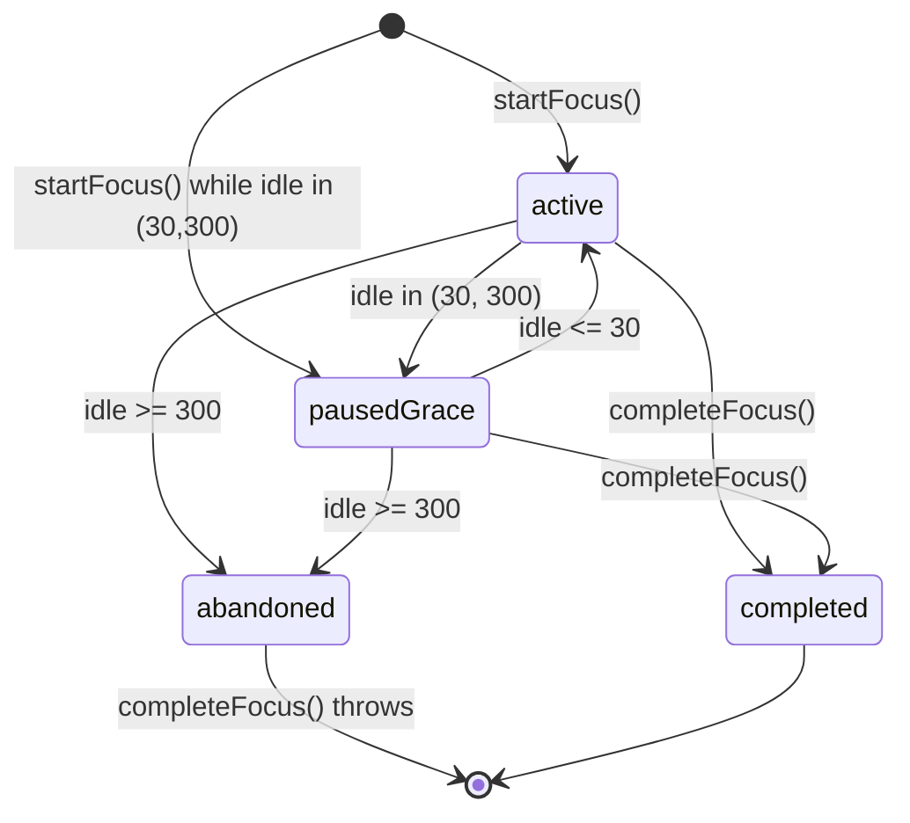

# Wave 1 Economy Audit Report

**Audit date:** 2026-09-16  
**Scope (read-only):** `PRODUCT.md` §2 (The Economic Engine), `SPEC.md` (economy-relevant sections §2.1–2.2, §3, §4), implementation under `Sources/ZoidLockInCore/Economy/`, UI/persistence under `Sources/ZoidLockInApp/` + `Sources/ZoidLockInEconomy/`.  
**Method:** Source-level comparison of every PRODUCT §2 / SPEC economy requirement against concrete types, constants, state machines, SQLite DDL, and SwiftUI bindings. Supporting tests under `Tests/ZoidLockInTests/` cited as evidence only (not executed in this pass).

---

## 1. Executive Verdict

| Area | Verdict | Confidence |
| :--- | :--- | :--- |
| **Earning velocity (1.0c/hr, 0.5c/30m)** | **PASS** — exact chunk arithmetic | High |
| **Morning momentum 2.0× before 12:00 PM** | **PASS** — start+end before noon, ≥90m continuous elapsed, once/day | High |
| **5-minute grace tolerance** | **PASS with nuance** — dual-threshold idle machine (30s → grace, 300s → abandon); PRODUCT “reset to minute 0” is implemented as abandon + new session, not in-place rewind | High |
| **`FocusSessionRecord` lifecycle** | **PASS** — active → paused_grace → completed \| abandoned; SQLite upsert + restore | High |
| **UI bindings** | **PASS with gaps** — live ticker/focus toggle wired; some labels are static or session-scoped mislabels | Medium |
| **SQLite persistence** | **PASS with schema drift** — WAL ledger works; DDL diverges from SPEC §3 names/columns | High |
| **PRODUCT §2.3 Offline meetings** | **PASS** (triple-gate + Gemini appeal) | High |
| **PRODUCT §2.4 Micro-habits** | **PASS** (1.5/day cap + frequency limits) | High |
| **PRODUCT §2.5 Friday rest** | **PASS** (hardcoded weekday check) | High |
| **SPEC `WorkspaceObserver` / NTP** | **GAP** — no ScreenCaptureKit/frontmost observer; clock guard is wall↔monotonic skew, not remote NTP | High |

**Overall Wave-1 economic core:** **functionally aligned** with PRODUCT §2 earning/momentum/grace rules and exercised by deterministic tests. **Specification drift** is material in schema naming, transaction-type vocabulary, debt modeling (`active_debt` column vs signed wallet balance), and the missing `WorkspaceObserver` module.

---

## 2. Sources of Truth Mapped

### 2.1 PRODUCT.md §2 requirements (checklist)

| ID | Requirement (condensed) | Primary implementation | Status |
| :--- | :--- | :--- | :--- |
| P2.1a | 1 hour verified deep work = **1.0** credit | `FocusMinting.baseCredits` / `creditPerHour` | **PASS** |
| P2.1b | 30 continuous minutes = **0.5** credits | `secondsPerHalfCredit = 1800`, `halfCredit = 0.5` | **PASS** |
| P2.1c | Daily target volume 6.0–10.0 credits (product guidance) | Soft guidance only; engine target for deficit is **3.0** (bed baseline) | **N/A / INFORMATIONAL** |
| P2.2a | First continuous **90-minute** block before **12:00 PM** | `morningBlockSeconds = 5400` + `qualifiesForMorningMomentum` | **PASS** |
| P2.2b | Start or finish after noon → standard **1.0×** (1.5 credits for 90m) | Both `startedAt` and `endedAt` must be hour `< 12` | **PASS** |
| P2.2c | **5-minute (300s)** interruption grace | `interruptionGraceSeconds = 300` | **PASS** |
| P2.2d | Pause >5m breaks continuity / resets block | Abandon session; new `startFocus` begins at 0 elapsed | **PASS (semantic)** |
| P2.2e | Reward **2.0×** → 1.5 × 2.0 = **3.0** | Bonus mint equal to base earned at completion | **PASS** |
| P2.2f | Work debt: multiply first, then subtract debt | Signed wallet; mints add into negative balance; spendable = `max(0, balance)` | **PASS (equivalent model)** |
| P2.3 | Triple-gate offline meeting + Gemini + 3-rejection appeal | `OfflineSessionCoordinator` + `OfflineMeetingAuditCoordinator` | **PASS** |
| P2.4 | Micro-habits + daily caps (freq + **1.5**/day) | `MicroHabitCoordinator` / `HabitCreditMinting.dailyCreditCap` | **PASS** |
| P2.5 | Permanent Friday rest (0 cost basics, no deficit) | `LocalCivilClock.isFriday` + `AmenityCatalog` + reconciliation | **PASS** |

### 2.2 SPEC.md economy requirements (checklist)

| ID | Requirement | Status |
| :--- | :--- | :--- |
| S2.1 | `ExchangeEngine` evaluates +1.0/hr, +0.5/30m, 2.0× morning, 300s grace, debt, midnight, curfew, Friday | **PASS** (debt via signed balance) |
| S2.1 | Anti-time-travel: monotonic + **remote NTP** (±120s) | **PARTIAL** — 120s wall↔mono skew lock; **no NTP client** |
| S2.2 | `WorkspaceObserver` (NSWorkspace / ScreenCaptureKit / Accessibility) | **FAIL / MISSING** |
| S2.2 | Anti-idle via CGEvent/IOHID; 5m idle → grace | **PARTIAL** — `CGEventIdleMonitor` present; thresholds are **30s grace / 300s abandon** (PRODUCT-aligned) |
| S3 | SQLite at `~/Library/Application Support/ZoidLockIn/db.sqlite`, **WAL** | **PASS** |
| S3 | DDL as published (`system_state`, `EARNED_WORK`, `is_morning_block`, …) | **DRIFT** — see §7 |
| S4 | Wallet SM: grace ↔ focus; morning bonus; debt netting; midnight vault | **PASS** (with naming differences) |

---

## 3. Deep Dive: Earning Velocity (1.0c/hr, 0.5c/30m)

### 3.1 Spec / product rule

- PRODUCT §2.1: 1 hour = **1.0**; 30 continuous minutes = **0.5**.
- SPEC §2.1: `ExchangeEngine` evaluates focus duration milestones (+1.0/hr, +0.5/30min).

### 3.2 Implementation

File: `Sources/ZoidLockInCore/Economy/FocusMinting.swift`

```swift
public static let secondsPerHalfCredit: TimeInterval = 30 * 60  // 1800
public static let halfCredit: Double = 0.5
public static let creditPerHour: Double = 1.0

public static func baseCredits(elapsedSeconds: TimeInterval) -> Double {
    guard elapsedSeconds >= secondsPerHalfCredit else { return 0 }
    let chunks = floor(elapsedSeconds / secondsPerHalfCredit)
    return CreditMath.normalize(chunks * halfCredit)
}
```

**Behavior:**

| Elapsed | Chunks | Credits |
| ---: | ---: | ---: |
| < 1800s | 0 | 0.0 |
| 1800s | 1 | 0.5 |
| 3600s | 2 | 1.0 |
| 5400s | 3 | 1.5 |
| 7200s | 4 | 2.0 |

Minting is **floor-chunked**, not continuous fractional accrual. Sub-30-minute remainders do not mint until the next half-hour boundary.

### 3.3 Engine application

`ExchangeEngine.mintUnpaidLocked` computes `due = FocusMinting.baseCredits(elapsedSeconds:)` and appends a `.mint` wallet transaction for the unpaid delta, keyed by `session.id`. Progressive minting occurs on each focus tick while presence is `.active` (`syncFocusLocked`).

Meeting yield reuses the same rate via `MeetingCreditMinting.credits` → `FocusMinting.baseCredits`.

### 3.4 Evidence

- Unit: `FocusMintingTests.standardChunks` (`EconomicLedgerTests.swift`)
- Integration: `ExchangeEngineTests.halfHourMilestones` (0.5 then 1.0 at 30m / 60m)

### 3.5 Gaps

- None for velocity arithmetic.
- PRODUCT “Daily Target Volume: 6.0 to 10.0” is aspirational UI/product text; deficit/victory accounting uses **`FocusMinting.dailyTargetCredits = 3.0`** (bed amenity baseline). Do not confuse the two.

---

## 4. Deep Dive: Morning Momentum (2.0× before 12:00 PM)

### 4.1 Spec / product rule

PRODUCT §2.2:

- First continuous uninterrupted **90-minute** focus block completed **prior to 12:00 PM**.
- Sessions commencing **or** finishing after noon mint at **1.0×** (1.5 credits for 90m).
- Reward: **2.0×** → 1.5 × 2.0 = **3.0**.
- Once-per-day implied by “the day’s first” block.
- Debt: multiply to 3.0 first, then subtract deficit/emergency debt.

### 4.2 Qualification logic

```42:54:Sources/ZoidLockInCore/Economy/FocusMinting.swift
    public static func qualifiesForMorningMomentum(
        elapsedSeconds: TimeInterval,
        startedAt: Date,
        endedAt: Date,
        calendar: Calendar,
        alreadyAwardedToday: Bool
    ) -> Bool {
        guard !alreadyAwardedToday else { return false }
        guard elapsedSeconds + 0.000_1 >= morningBlockSeconds else { return false }
        guard calendar.isDate(startedAt, inSameDayAs: endedAt) else { return false }
        return isBeforeLocalNoon(startedAt, calendar: calendar)
            && isBeforeLocalNoon(endedAt, calendar: calendar)
    }
```

Noon gate:

```90:92:Sources/ZoidLockInCore/Economy/FocusMinting.swift
    public static func isBeforeLocalNoon(_ date: Date, calendar: Calendar) -> Bool {
        calendar.component(.hour, from: date) < 12
    }
```

**Strictness notes:**

- Finishing **exactly at 12:00:00** fails (`hour < 12` is false) — tested in `FocusMintingTests.noonIsNotMorning`.
- Both start and end must be before noon — matches PRODUCT “commencing or finishing after 12:00”.
- Continuity is not a separate counter; it is enforced by the grace/abandon machine (elapsed only advances while `.active`).

### 4.3 Award application in `ExchangeEngine`

On `completeFocus` (and midnight finalize of an open same-day session):

1. Progressive base mints already applied via `mintUnpaidLocked` (so 90m → 1.5 already in wallet / `creditsEarned`).
2. `applyMorningMomentumIfNeededLocked` doubles by minting an **additional** `.mint` equal to current `session.creditsEarned`, description `"Morning Momentum 2.0×"`.
3. Sets `multiplierApplied = 2.0`.

Once-per-day guard: `hasMorningMomentum` scans completed sessions that day with `multiplierApplied == 2.0`.

### 4.4 Debt priority (PRODUCT P2.2f)

There is **no separate `active_debt` column**. Deficit (−1.0) and emergency (−2.0) are applied as `.penalty` transactions that leave `wallet_balance` negative. Incoming mints (base + morning bonus) add to that signed balance. `CreditMath.spendable` clamps display/spend to ≥ 0.

**Net effect for a −1.0 morning start + qualifying 90m block:**  
−1.0 + 3.0 = **+2.0** spendable — equivalent to “mint 3.0 then subtract 1.0 debt.”

**Caveat:** progressive minting during the block temporarily raises balance before the 2.0× bonus lands at completion. Debt is not held in a separate escrow then subtracted in one atomic “multiply then settle” step; settlement is continuous via signed balance. Functionally correct for product goals; differs from SPEC §4.2 wording that names `active_debt`.

### 4.5 Evidence

- `ExchangeEngineTests.morningMomentumVersusAfternoon` → morning 3.0 / afternoon 1.5
- `ExchangeEngineTests.graceWindowPreservesProgress` → resume after 299s idle still earns morning 3.0
- `ExchangeEngineTests.sqliteBackedMorningBlock` → SQLite persists momentum transaction

### 4.6 Gaps

- No dedicated test asserting morning 3.0 against a pre-existing −1.0 / −2.0 wallet (logic is compositionally sound but underexercised).
- Live UI always advertises “2.0x MULTIPLIER” copy; `snapshot.multiplierApplied` remains 1.0 until completion (see §8).

---

## 5. Deep Dive: 5-Minute Grace Tolerance

### 5.1 Spec / product rule

- PRODUCT: 5-minute (300s) grace; exceeding breaks continuity and resets block to minute 0.
- SPEC §2.1: enforce 300s interruption grace.
- SPEC §2.2 wording (“5 consecutive minutes of zero input → enter 300s grace”) **conflicts** with PRODUCT and with the implemented dual-threshold machine.

### 5.2 Implemented presence machine

```24:34:Sources/ZoidLockInCore/Economy/FocusMinting.swift
    /// Dual-threshold idle machine. Typing pauses (`idle <= 30`) stay active;
    /// `30 < idle < 300` holds elapsed in grace; `idle >= 300` abandons.
    public static func presence(idleSeconds: TimeInterval) -> Presence {
        if idleSeconds >= interruptionGraceSeconds {
            return .abandoned
        }
        if idleSeconds > activePresenceSeconds {
            return .grace
        }
        return .active
    }
```

Constants:

| Constant | Value | Role |
| :--- | ---: | :--- |
| `activePresenceSeconds` | **30** | Idle ≤30s still counts as active (typing pause tolerance) |
| `interruptionGraceSeconds` | **300** | Idle ≥300s abandons |

`ExchangeEngine.syncFocusLocked`:

- `.grace` → `state = .pausedGrace`; **elapsed does not advance**
- `.active` after grace → resume; still no rewind
- `.abandoned` → persist abandoned session; `completeFocus` throws `.sessionAbandoned`

Idle sensor: `CGEventIdleMonitor` (`CGEventSource.secondsSinceLastEventType` / HID). Comments acknowledge USB jigglers as residual risk. **No** `NSWorkspace` / ScreenCaptureKit frontmost classification.

### 5.3 PRODUCT “reset to minute 0” interpretation

| Interpretation | Implemented? |
| :--- | :--- |
| Abandon current continuous block; next session starts at 0 elapsed | **Yes** |
| Rewind the same session’s `elapsedSeconds` to 0 in place | **No** |
| Reverse already-minted half-credit milestones | **No** — wallet keeps prior `.mint` rows |

This matches a sensible anti-cheat reading (don’t claw back earned milestones) while still forcing a **new continuous 90m** for morning bonus. Abandoned sessions cannot complete and therefore cannot receive morning momentum (`graceExpiryAbandons` test keeps wallet at 0.5).

### 5.4 Evidence

- `Slice3AdversarialHardeningTests` presence table: 30 active, 30.001 grace, 300 abandoned
- `ExchangeEngineTests.graceWindowPreservesProgress` / `graceExpiryAbandons`

### 5.5 Gaps

- SPEC §2.2 narrative about WorkspaceObserver + “5m idle enters grace” is **not** what shipped; PRODUCT dual-window is.
- No whitelisted-app / lock-screen interruption path beyond physical-input idle.

---

## 6. Deep Dive: `FocusSessionRecord` Lifecycle

### 6.1 Model

File: `Sources/ZoidLockInCore/Economy/EconomicRecords.swift`

```swift
public enum FocusSessionState: String, Codable {
    case active
    case pausedGrace = "paused_grace"
    case completed
    case abandoned
}

public struct FocusSessionRecord {
    var id: UUID
    var startTime: Date
    var endTime: Date?
    var elapsedSeconds: TimeInterval
    var state: FocusSessionState
    var creditsEarned: Double
    var multiplierApplied: Double  // default 1.0
}
```

### 6.2 State transitions



Additional rules:

- Cannot `startFocus` while another live session is active/grace, or while offline meeting is punched in (`offlineMeetingActive`).
- Cannot start if already idle-abandoned at punch-in (`sessionAbandoned`).
- On init, `restoreLiveSession()` reloads last active/grace row from ledger.
- Midnight reconciliation `finalizeOpenSessionLocked` force-completes same-day open sessions at 23:59:59.

### 6.3 Persistence touchpoints

Every transition calls `ledger.upsertFocusSession`. Credits land in `wallet_transactions` (append-only), not only on the session row.

### 6.4 SPEC naming drift

| SPEC `focus_sessions` | Implementation |
| :--- | :--- |
| `duration_seconds` | `elapsed_seconds` |
| `is_morning_block` INTEGER | Derived: `multiplier_applied == 2.0` |
| `credits_minted` | `credits_earned` |
| `interruption_seconds` | **Absent** (idle handled ephemerally via detector) |
| `status` ACTIVE/COMPLETED/ABORTED | `state` active/paused_grace/completed/abandoned |

---

## 7. Deep Dive: SQLite Persistence

### 7.1 Location & mode

- Path helper: `EconomicLedgerLocation.defaultFileURL` → `~/Library/Application Support/ZoidLockIn/db.sqlite`
- App wiring: `MenuBarSession` → `SQLiteEconomicLedger.default()`
- Journal: `PRAGMA journal_mode = WAL` in `SQLiteDatabase.init`
- Implementation: system SQLite3 C API (`SQLiteEconomicLedger`), **not GRDB** (SPEC mentions GRDB)

### 7.2 Focus + wallet schema (actual)

```sql
CREATE TABLE IF NOT EXISTS wallet_transactions (
    id TEXT PRIMARY KEY,
    timestamp TEXT NOT NULL,
    amount REAL NOT NULL,
    balance_after REAL NOT NULL,
    transaction_type TEXT NOT NULL,
    reference_id TEXT,
    description TEXT NOT NULL
);
-- APPEND-ONLY via BEFORE UPDATE/DELETE triggers

CREATE TABLE IF NOT EXISTS focus_sessions (
    id TEXT PRIMARY KEY,
    start_time TEXT NOT NULL,
    end_time TEXT,
    elapsed_seconds INTEGER NOT NULL DEFAULT 0,
    state TEXT NOT NULL,
    credits_earned REAL NOT NULL DEFAULT 0.0,
    multiplier_applied REAL NOT NULL DEFAULT 1.0
);

CREATE TABLE IF NOT EXISTS lifetime_vault (
    id INTEGER PRIMARY KEY CHECK (id = 1),
    total_surplus_credits REAL NOT NULL DEFAULT 0.0,
    current_streak INTEGER NOT NULL DEFAULT 0,
    highest_streak INTEGER NOT NULL DEFAULT 0
);

CREATE TABLE IF NOT EXISTS daily_reconciliations ( ... );
```

Directory/file permissions set to `0700` / `0600` on create.

### 7.3 SPEC §3 DDL vs reality (material drift)

| SPEC artifact | Reality |
| :--- | :--- |
| `system_state` (wallet_balance, active_debt, vault, streak, …) | **Split:** balance = last `wallet_transactions.balance_after`; vault/streak = `lifetime_vault`; no `active_debt` column |
| Tx types `EARNED_WORK`, `EARNED_MOMENTUM`, `EARNED_MICRO`, `SPENT_AMENITY`, `DEBT_REPAYMENT`, `EMERGENCY_PENALTY` | Actual: `mint`, `EARNED_MEETING`, `EARNED_HABIT`, `spend`, `refund_amenity`, `penalty`, `reset`, `surplus_transfer` |
| Morning bonus as distinct `EARNED_MOMENTUM` type | Same `.mint` type; distinguished by description `"Morning Momentum 2.0×"` |
| `active_amenity_passes` table | Passes live in daemon / voucher path (not this ledger table) |
| `micro_habit_logs` | `micro_habit_completions` |
| GRDB | Raw SQLite3 |

**Persistence correctness for Wave-1 economy:** upserts, append-only wallet, restore of live focus, and morning-block SQLite test all support a **PASS** on durability. Spec compliance on DDL naming is **FAIL / DRIFT**.

### 7.4 Atomicity

`performAtomically` → `BEGIN IMMEDIATE` / `COMMIT` / `ROLLBACK`. Focus tick mints session + transaction in one immediate transaction when advancing elapsed.

---

## 8. Deep Dive: UI Bindings (`ZoidLockInApp` + Economy views)

### 8.1 Composition root

`Sources/ZoidLockInApp/ZoidLockInApp.swift` is the only App target file. It owns:

| Binding | Path |
| :--- | :--- |
| SQLite ledger | `SQLiteEconomicLedger.default()` |
| Engine | `ExchangeEngine(ledger:…, focusClock: MachUptimeClock(), activityDetector: CGEventIdleMonitor default)` |
| 1 Hz tick | `DispatchSourceTimer` → `EconomyTickCoordinator.reconcileIncidentsAndTick` → `@Published snapshot` |
| Focus toggle | `MenuBarSession.toggleFocus` → `engine.completeFocus()` / `startFocus()` |
| Menu bar chrome | `MenuBarExtra` + `MenuBarTickerLabel(snapshot:)` |
| Companion surfaces | `MenuBarExtraView` → Focus / Market / Meeting / Habits |
| Command dashboard | `Window` + `CommandDashboardView(snapshot: session.dashboard)` |

Views themselves live in `Sources/ZoidLockInEconomy/` (imported by the app). Auditing UI without that module would be incomplete; App is the wiring layer.

### 8.2 Focus UI → economy fields

`FocusPopoverView` bindings:

| UI element | Snapshot field | Accuracy |
| :--- | :--- | :--- |
| Elapsed timer | `formattedElapsed` ← `focusElapsedSeconds` | **Correct** |
| Day caption | `dayStateCaption` (“Morning Focus” / “Grace” / …) | **Correct** |
| Next mint countdown | `focusRemainingToNextMintSeconds` → “+0.5c in mm:ss” | **Correct** |
| “EARNED TODAY” | `focusCreditsEarned` | **Mislabel** — this is **session** credits, not civil-day total |
| Wallet | `formattedBalance` | **Correct** (signed balance display) |
| Grace banner | `focusState == .pausedGrace` → “5-MINUTE GRACE…” | **Correct** |
| Momentum copy | Static marketing text | **Not live-bound** to eligibility / `multiplierApplied` |
| Footer rate | Static “RATE: 1.0c / HR” | **Correct** as base rate reminder |

`MenuBarTickerView` / label show balance, focus status, streak, vault, next +0.5 countdown.

### 8.3 Gaps (UI)

1. **“EARNED TODAY”** should aggregate civil-day `.mint` / meeting / habit credits, or be renamed “SESSION EARNED”.
2. **Multiplier chip** does not reflect whether today’s morning bonus is still available.
3. No dedicated UI for remaining grace seconds (only state caption “Grace”).
4. Abandoned state is shown if snapshot still holds abandoned session; after abandon, engine keeps `liveSession` abandoned until next start — UI can show “Abandoned” until user punches in again (acceptable).

---

## 9. Remaining PRODUCT §2 Features

### 9.1 §2.3 Triple-Gate Offline Meetings — **PASS**

| Gate | Implementation |
| :--- | :--- |
| Punch-in / punch-out | `OfflineSessionCoordinator.punchIn/Out` with monotonic + uptime clocks |
| Agenda + receipt + photo | Artifact kinds + SHA-256; EXIF via `MeetingPhotoValidator` |
| Gemini audit | `GeminiAuditClient` (Flash) + Pro appeal |
| 3 consecutive rejections → appeal | `GeminiAuditPolicy.rejectionsBeforeAppeal = 3` |
| 30-day artifact purge | `OfflineMeetingPolicy.artifactRetention = 30 days` |
| Credit mint | Same 0.5/30m rate; daily meeting cap **4.0** (SPEC/product extension) |

UI: `OfflineMeetingPopoverView` wired through `MenuBarSession` punch/submit/appeal/import.

### 9.2 §2.4 Micro-Habits — **PASS**

- Cap: `HabitCreditMinting.dailyCreditCap = 1.5` (+ rolling 24h monotonic conservatism).
- Frequency limits enforced per habit (`dailyFrequencyLimit` 1 or 2).
- Representative catalog appears in proof snapshots (Brushing 0.25×2, Bed 0.25, Hydration 0.25, Stretching 0.50).
- CRUD gated by 48h governance lock (`GovernanceLockCoordinator`) — beyond §2 but present.

### 9.3 §2.5 Friday Rest — **PASS**

- `LocalCivilClock.isFriday` (Gregorian weekday == 6).
- Basic comforts (bed, food, phone, rest) cost **0**; outing/streaming/gaming still priced.
- Reconciliation skips deficit strikes on Friday (`fridayRestMode`).
- Not admin-togglable in engine (hardcoded civil rule).

---

## 10. SPEC Cross-Cutting Gaps (Economy-Adjacent)

| SPEC claim | Finding |
| :--- | :--- |
| Remote NTP baseline on startup | **Missing.** `TimeTravelGuard` compares wall delta vs monotonic delta; lock if \|skew\| > 120s. |
| `WorkspaceObserver` + ScreenCaptureKit whitelist | **Missing.** Only `ActivityDetecting` / `CGEventIdleMonitor`. |
| Separate `active_debt` field + automatic consumption before wallet increment | **Equivalent** via signed balance + `spendable`, not literal schema. |
| Transaction type vocabulary | **Renamed** (see §7.3). |
| GRDB | **Not used**; raw SQLite3. |
| Curfew 22:00–04:00 | **PASS** (`LocalCivilClock.isCurfew`) |
| Midnight surplus vault + victory streak | **PASS** (`reconcileLocked`) |
| Deficit −1.0 / emergency −2.0 | **PASS** (penalty txs at reconciliation) |

---

## 11. Feature Compliance Matrix (Concise)

| Feature | PRODUCT | SPEC | Code | UI | SQLite | Tests |
| :--- | :---: | :---: | :---: | :---: | :---: | :---: |
| 0.5 / 30m mint | ✓ | ✓ | ✓ | ✓ countdown | ✓ mint rows | ✓ |
| 1.0 / hour | ✓ | ✓ | ✓ | ✓ footer | ✓ | ✓ |
| 90m morning 2.0× | ✓ | ✓ | ✓ | partial | ✓ | ✓ |
| Noon cutoff | ✓ | ✓ | ✓ | caption only | n/a | ✓ |
| 300s grace | ✓ | ✓* | ✓ | ✓ banner | state only | ✓ |
| Session lifecycle | ✓ | ✓ | ✓ | ✓ | ✓ upsert | ✓ |
| Debt after momentum | ✓ | ✓* | ✓ equiv | spendable clamp | signed bal | partial |
| Offline meetings | ✓ | ✓ | ✓ | ✓ | ✓ | ✓ |
| Micro-habits 1.5 cap | ✓ | ✓ | ✓ | ✓ | ✓ | ✓ |
| Friday rest | ✓ | ✓ | ✓ | ✓ badge | recon flag | ✓ |
| WorkspaceObserver | — | ✓ | ✗ | ✗ | — | ✗ |
| Remote NTP | — | ✓ | ✗ | tamper caption | — | skew only |

\*SPEC text partially conflicts with PRODUCT on grace narrative and debt column shape.

---

## 12. Risk Register

| Severity | Issue | Impact |
| :--- | :--- | :--- |
| **Medium** | No WorkspaceObserver / app whitelist | Focus can mint while non-work apps are frontmost if HID input continues |
| **Medium** | No remote NTP | Determined clock skew attacks harder; local wall↔mono still catches crude jumps |
| **Low** | UI “EARNED TODAY” = session credits | User confusion vs daily wallet |
| **Low** | SPEC DDL / type names diverge | Docs/onboarding/SQL tooling mismatch; runtime OK |
| **Low** | Morning bonus as second `.mint` not `EARNED_MOMENTUM` | Analytics filters must use description or multiplier |
| **Info** | Grace abandon keeps minted milestones | Aligns with anti-clawback; differs from literal “reset” wording |

---

## 13. Recommended Follow-Ups (non-blocking for Wave 1)

1. Update SPEC §3 DDL and transaction enums to match `SQLiteEconomicLedger` (or add a migration note).
2. Clarify SPEC §2.2 idle narrative to the dual-threshold 30s/300s machine.
3. Rename Focus popover “EARNED TODAY” → “SESSION EARNED” (or bind civil-day sum).
4. Add integration test: start day at −1.0 / −2.0, complete morning 90m → expect net +2.0 / +1.0.
5. If product still wants Zoid 0 heritage tracking, schedule `WorkspaceObserver` as a later slice — explicitly out of current Economy mint path.

---

## 14. File Index Touched by This Audit

**Docs:** `PRODUCT.md` §2, `SPEC.md` §§2–4  

**Core economy:**  
`FocusMinting.swift`, `ExchangeEngine.swift`, `EconomicRecords.swift`, `EconomicLedger.swift`, `ActivityDetector.swift`, `LocalCivilClock.swift`, `MenuBarTickerSnapshot.swift`, `TimeTravelGuard.swift`, `OfflineSessionCoordinator.swift`, `OfflineMeetingAuditCoordinator.swift`, `MicroHabitCoordinator.swift`, `MicroHabitRecords.swift`, `AmenityCatalog.swift`

**Persistence / UI:**  
`SQLiteEconomicLedger.swift`, `SQLiteDatabase.swift`, `EconomyTickCoordinator.swift`, `FocusPopoverView.swift`, `MenuBarTickerView.swift`, `MarketplaceView.swift` (`MenuBarExtraView`), `ZoidLockInApp.swift`

**Tests (evidence):**  
`ExchangeEngineTests.swift`, `EconomicLedgerTests.swift` (`FocusMintingTests`), `Slice3AdversarialHardeningTests.swift`, plus slice 6–8 suites for meetings/habits

---

## 15. Closing Statement

Wave 1’s earning engine **faithfully implements** PRODUCT §2.1–2.2 velocity, morning momentum, and grace semantics in `FocusMinting` + `ExchangeEngine`, with durable SQLite persistence and live menu-bar / focus UI bindings. Offline meetings, micro-habits, and Friday rest under the same PRODUCT section are present and coherent. Remaining work is primarily **specification hygiene** (schema vocabulary, NTP/WorkspaceObserver claims) and **UI labeling polish**, not core mint arithmetic.
