# Wave 3 E2E Focus Lifecycle Audit Report

**Audit date:** 2026-09-16  
**Repository revision:** `a5dfed0adb467546e42e9387ade9ccc0aa6add71` (`main`)  
**Scope (read-only):** Complete end-to-end Focus Work Session lifecycle against `PRODUCT.md` §2.1–§2.5 and `SPEC.md` §2.1, spanning punch-in / session start, progressive 30-minute minting, Morning Momentum 2.0× (illustrative 3.0c for a 90-minute pre-noon block), 5-minute pause/grace, and midnight balance rollover. Adjacent PRODUCT §2.3–§2.5 surfaces (offline punch-in, micro-habits, Friday rest) are included because they share the same `ExchangeEngine` day wallet.  
**Primary subjects:** `FocusMinting`, `ExchangeEngine` (`startFocus` / `syncFocusLocked` / `completeFocus` / `reconcileLocked`), `ActivityDetector` / `CGEventIdleMonitor`, `FocusSessionRecord`, `OfflineSessionCoordinator`, `MicroHabitCoordinator`, `AmenityCatalog`, `FocusPopoverView` / `MenuBarSession.toggleFocus`.  
**Method:** Source-level walk of every lifecycle transition against PRODUCT/SPEC text, SQLite persistence, and deterministic tests under `Tests/ZoidLockInTests/`. Tests were **not executed** in this pass (`swift test --filter ExchangeEngineTests` fails to compile: `no such module 'Testing'`). Written assertions are design evidence only.

---

## 1. Executive Verdict

| Lifecycle stage | Verdict | Confidence |
| :--- | :--- | :--- |
| **A. Punch-in / session start** | **PASS** — digital focus via `startFocus`; offline via `punchIn` with mutual exclusion | High |
| **B. 30-minute interval +0.5c minting** | **PASS** — floor chunks of 1800s → 0.5; progressive mint on each active tick | High |
| **C. Morning Momentum 2.0× (pre-12:00)** | **PASS with nuance** — first ≥90m continuous block with start+end hour `< 12` doubles yield (90m → **3.0c**); **no hard 3.0c ceiling** if the qualifying session runs longer | High |
| **D. 5-minute pause / grace window** | **PASS with nuance** — idle `30 < t < 300` freezes elapsed; `≥ 300` abandons (PRODUCT “reset to minute 0” = abandon + new `startFocus`) | High |
| **E. Midnight balance rollover** | **PASS** — close at local `23:59:59`; surplus → vault; wallet → 0 (or deficit/emergency penalties leave signed negative) | High |
| **PRODUCT §2.3 Offline meetings** | **PASS** — punch-in/out, triple artifacts, Gemini Flash + 3-rejection Pro appeal | High |
| **PRODUCT §2.4 Micro-habits** | **PASS** — per-task frequency + **1.5**/day cap | High |
| **PRODUCT §2.5 Friday rest** | **PASS** — hardcoded weekday; basics 0 cost; no deficit strike | High |
| **SPEC §2.1 NTP anti-time-travel** | **PARTIAL / GAP** — 120s wall↔monotonic skew lock; **no remote NTP client** | High |

**Overall Wave-3 focus lifecycle:** **functionally end-to-end aligned** with PRODUCT §2.1–§2.5 earning, momentum, grace, offline, habits, and Friday rules, and with SPEC §2.1 `ExchangeEngine` responsibilities except remote NTP. The material product ambiguity is whether Morning Momentum is a **session-wide 2.0×** (implemented) or a **hard 3.0c cap** for the morning block (PRODUCT/SPEC example language only).

---

## 2. Sources of Truth Mapped

### 2.1 PRODUCT.md §2.1–§2.5 checklist

| ID | Requirement (condensed) | Primary implementation | Status |
| :--- | :--- | :--- | :--- |
| P2.1a | 1 hour verified deep work = **1.0** credit | `FocusMinting.creditPerHour` / `baseCredits` | **PASS** |
| P2.1b | 30 continuous minutes = **0.5** credits | `secondsPerHalfCredit = 1800`, `halfCredit = 0.5` | **PASS** |
| P2.1c | Daily target volume 6.0–10.0 (product guidance) | Soft guidance; deficit/victory engine uses **3.0** bed baseline | **N/A / INFORMATIONAL** |
| P2.2a | First continuous **90-minute** block before **12:00 PM** | `morningBlockSeconds = 5400` + `qualifiesForMorningMomentum` | **PASS** |
| P2.2b | Start or finish after noon → standard **1.0×** | Both `startedAt` and `endedAt` must have hour `< 12` | **PASS** |
| P2.2c | **5-minute (300s)** interruption grace | `interruptionGraceSeconds = 300` | **PASS** |
| P2.2d | Pause >5m breaks continuity / resets block | Abandon; next `startFocus` at elapsed 0 | **PASS (semantic)** |
| P2.2e | Reward **2.0×** → 1.5 × 2.0 = **3.0** (90m example) | Bonus mint = current `creditsEarned` on complete | **PASS** (see §5 for uncapped longer sessions) |
| P2.2f | Work debt: multiply first, then subtract debt | Signed wallet; mints add into negative balance | **PASS (equivalent model)** |
| P2.3 | Triple-gate offline punch-in + Gemini + 3-rejection appeal | `OfflineSessionCoordinator` + `OfflineMeetingAuditCoordinator` | **PASS** |
| P2.4 | Micro-habits + daily caps (freq + **1.5**/day) | `HabitCreditMinting.dailyCreditCap = 1.5` | **PASS** |
| P2.5 | Permanent Friday rest (0-cost basics, no deficit) | `LocalCivilClock.isFriday` + reconcile gate | **PASS** |

### 2.2 SPEC.md §2.1 checklist

| ID | Requirement | Status |
| :--- | :--- | :--- |
| S2.1a | Pure deterministic `ExchangeEngine` on timestamped events | **PASS** |
| S2.1b | Monotonic elapsed + authenticated remote **NTP** (±120s lock) | **PARTIAL** — mono elapsed + 120s wall↔mono; **no NTP** |
| S2.1c | Evaluate +1.0/hr, +0.5/30min milestones | **PASS** |
| S2.1d | 90-minute morning momentum **2.0×** before 12:00 | **PASS** |
| S2.1e | Enforce 300-second interruption grace | **PASS** |
| S2.1f | Debt settlement on session completion | **PASS (equiv.)** — continuous signed-balance netting |
| S2.1g | Midnight expiration, surplus vault, streaks | **PASS** |
| S2.1h | 22:00 curfew + permanent Friday rest | **PASS** |

### 2.3 Key constants

| Constant | Value | Location |
| :--- | ---: | :--- |
| `secondsPerHalfCredit` | **1800** | `FocusMinting.swift` |
| `halfCredit` / `creditPerHour` | **0.5** / **1.0** | `FocusMinting.swift` |
| `morningBlockSeconds` | **5400** | `FocusMinting.swift` |
| `morningMomentumMultiplier` | **2.0** | `FocusMinting.swift` |
| `activePresenceSeconds` | **30** | `FocusMinting.swift` |
| `interruptionGraceSeconds` | **300** | `FocusMinting.swift` |
| `dailyTargetCredits` (deficit/streak) | **3.0** | `FocusMinting.swift` |
| Close timestamp | local **23:59:59** | `ExchangeEngine.closeTimestamp` |
| Habit daily cap | **1.5** | `HabitCreditMinting` |
| Meeting daily cap | **4.0** | `MeetingCreditMinting` |
| Gemini appeal gate | **3** consecutive rejections | `GeminiAuditPolicy.rejectionsBeforeAppeal` |

---

## 3. End-to-End Lifecycle Map

```mermaid
stateDiagram-v2
    [*] --> Idle: Day open / post-reconcile
    Idle --> FocusActive: startFocus() / toggleFocus ON
    Idle --> OfflineRecording: punchIn()
    FocusActive --> FocusActive: tick + physical idle ≤ 30s\n(+elapsed; mint unpaid chunks)
    FocusActive --> GraceWait: idle 30 < t < 300\n(elapsed frozen)
    GraceWait --> FocusActive: idle ≤ 30 again\n(resume; no rewind)
    GraceWait --> Abandoned: idle ≥ 300\n(no morning bonus; keep prior mints)
    FocusActive --> Completed: completeFocus() / toggleFocus OFF
    GraceWait --> Completed: completeFocus() while in grace
    Completed --> MorningBonus: qualifies (≥90m, start+end < noon, once/day)
    Completed --> Idle: standard 1.0×
    MorningBonus --> Idle: +mint equal to base earned (2.0× total)
    OfflineRecording --> Idle: punchOut → submit → Gemini mint
    FocusActive --> Completed: beginOfflineMeeting auto-completes focus
    Idle --> MidnightClose: reconcileIfNeeded (past civil day)
    MidnightClose --> Idle: surplus→vault; deficit/emergency penalties
```



### 3.1 Actor entry points

| Surface | User action | Engine entry |
| :--- | :--- | :--- |
| Menu bar / `FocusPopoverView` | Toggle focus | `MenuBarSession.toggleFocus` → `completeFocus()` if live, else `startFocus()` |
| Offline meeting UI | Punch toggle | `MenuBarSession.punchToggle` → `OfflineSessionCoordinator.togglePunch` → `punchIn` / `punchOut` |
| Periodic ticker | Background tick | `ExchangeEngine.tick()` → `reconcileIfNeededLocked` + `syncFocusLocked` |
| Day rollover | First tick after local midnight | `reconcileIfNeeded` walks unreconciled days through yesterday |

**Naming note:** PRODUCT §2.3 reserves “Punch-In / Punch-Out” for **offline meetings**. Digital deep work uses **start / complete** focus (`FocusSessionRecord`), not the offline punch tables. Both paths feed the same daily wallet.

---

## 4. Stage A — Punch-In / Session Start

### 4.1 Digital focus (`startFocus`)

```457:486:Sources/ZoidLockInCore/Economy/ExchangeEngine.swift
    public func startFocus(id: UUID = UUID()) throws -> FocusSessionRecord {
        try withLock {
            try observeClocksLocked()
            try ensureWritableLocked()
            try reconcileIfNeededLocked()
            if offlineMeetingRecording {
                throw ExchangeEngineError.offlineMeetingActive
            }
            if let liveSession, liveSession.state == .active || liveSession.state == .pausedGrace {
                throw ExchangeEngineError.focusAlreadyActive
            }
            // ...
            let session = FocusSessionRecord(
                id: id,
                startTime: nowWall,
                elapsedSeconds: 0,
                state: FocusMinting.presence(idleSeconds: idle) == .grace ? .pausedGrace : .active
            )
```

Guards:

1. Clock writable (time-travel gate).
2. Catch-up midnight reconcile before opening the session.
3. Cannot start while offline meeting mutex held.
4. Cannot start while another focus session is `active` / `paused_grace`.
5. Cannot start if current idle already ≥ 300s (`.sessionAbandoned`).
6. If idle is already in the grace band (`30 < idle < 300`), session opens in `.pausedGrace` with elapsed 0.

Persistence: `ledger.upsertFocusSession` into SQLite `focus_sessions` (`state`, `elapsed_seconds`, `credits_earned`, `multiplier_applied`).

UI: `FocusPopoverView` binds `onToggleFocus`; live states `.active` / `.pausedGrace` show as focus-on.

### 4.2 Offline meeting punch-in (`punchIn`) — PRODUCT §2.3 Gate 1

`OfflineSessionCoordinator.punchIn`:

1. Calls `focusEngine?.beginOfflineMeeting()`, which **auto-completes** any live focus (mint unpaid + morning check) then sets `offlineMeetingRecording = true`.
2. Records wall + continuous monotonic + uptime punch-in stamps + boot session UUID.
3. Blocks a second concurrent digital focus (`offlineMeetingActive`).

Alignment with PRODUCT Gate 1 (exact punch-in/out) and Gate 2/3 (artifacts + Gemini) is present; see §9.

**Verdict A:** **PASS**.

---

## 5. Stage B — 30-Minute Interval +0.5c Minting

### 5.1 Pure arithmetic

```36:40:Sources/ZoidLockInCore/Economy/FocusMinting.swift
    public static func baseCredits(elapsedSeconds: TimeInterval) -> Double {
        guard elapsedSeconds >= secondsPerHalfCredit else { return 0 }
        let chunks = floor(elapsedSeconds / secondsPerHalfCredit)
        return CreditMath.normalize(chunks * halfCredit)
    }
```

| Elapsed | Chunks | Credits |
| ---: | ---: | ---: |
| 1799s | 0 | **0** |
| 1800s | 1 | **0.5** |
| 3600s | 2 | **1.0** |
| 5400s | 3 | **1.5** |
| 7200s | 4 | **2.0** |

### 5.2 Progressive mint path

On each `tick` / `syncFocusLocked` while presence is `.active`:

1. Add `max(0, nowMono − lastTick)` to `elapsedSeconds` (focus uses **uptime** clock so sleep does not mint).
2. `mintUnpaidLocked`: `delta = baseCredits(elapsed) − session.creditsEarned`; append `.mint` wallet row if `delta > 0`.
3. Upsert session.

Completion also calls `mintUnpaidLocked` so the final chunk is not lost if the user stops between ticks.

**Test evidence:** `ExchangeEngineTests.halfHourMilestones` (0.5 then 1.0); `FocusMintingTests.standardChunks`.

**Verdict B:** **PASS**.

---

## 6. Stage C — Morning Momentum 2.0× (Pre-12:00)

### 6.1 Qualification

```42:54:Sources/ZoidLockInCore/Economy/FocusMinting.swift
    public static func qualifiesForMorningMomentum(
        elapsedSeconds: TimeInterval,
        startedAt: Date,
        endedAt: Date,
        calendar: Calendar,
        alreadyAwardedToday: Bool
    ) -> Bool {
        guard !alreadyAwardedToday else { return false }
        guard elapsedSeconds + 0.000_1 >= morningBlockSeconds else { return false }
        guard calendar.isDate(startedAt, inSameDayAs: endedAt) else { return false }
        return isBeforeLocalNoon(startedAt, calendar: calendar)
            && isBeforeLocalNoon(endedAt, calendar: calendar)
    }
```

| Rule | Implemented? |
| :--- | :--- |
| Continuous ≥ 90 minutes elapsed | Yes (`≥ 5400`) |
| Start before local noon | Yes (`hour < 12`) |
| End before local noon | Yes (`hour < 12`) |
| Finish exactly **12:00:00** | **Fails** qualification (`noonIsNotMorning`) |
| Once per civil day | Yes — `hasMorningMomentum` scans completed sessions with `multiplierApplied == 2.0` |
| Cross-midnight session | Rejected (`isDate(_:inSameDayAs:)`) |

### 6.2 Award application

On `completeFocus` and on midnight `finalizeOpenSessionLocked`:

1. Mint unpaid base credits.
2. If qualifies, append a second `.mint` equal to **current** `session.creditsEarned`, description `"Morning Momentum 2.0×"`.
3. Set `multiplierApplied = 2.0`.

For a clean 90-minute morning block: base **1.5** + bonus **1.5** = **3.0**. Matches PRODUCT §2.2 reward example and SPEC §4.1 `"1.5h * 2.0 = 3.0"`.

### 6.3 “3.0c cap” interpretation

| Interpretation | Product/SPEC text | Code behavior |
| :--- | :--- | :--- |
| **Example yield for exactly 90m** | Explicit 1.5 × 2.0 = 3.0 | **Matches** |
| **Hard ceiling of 3.0 on any morning session** | Not stated as a clamp; SPEC SM labels the 90m case | **Not implemented** — a 120m pre-noon qualifying session yields base 2.0 + bonus 2.0 = **4.0** |
| **Once-per-day acceleration** | “day's first continuous … block” | **Matches** |

**Finding W3-1 (product ambiguity, Medium):** If product intent is a hard **3.0c morning-block cap**, the engine is over-generous for longer pre-noon sessions. If intent is **2.0× the entire qualifying session**, implementation is correct and the “3.0c” figure is only the 90-minute worked example. Recommend clarifying PRODUCT §2.2 / SPEC §4.1, then either clamp bonus so total morning-session yield ≤ 3.0 or document uncapped 2.0×.

Debt netting (PRODUCT §2.2 Work Debt Priority): there is no separate `active_debt` column. A morning completion that posts +3.0 into a −1.0 wallet lands at +2.0 spendable — equivalent to “multiply then subtract” when no mid-session spends intervene (see Wave 2 balances audit).

**Test evidence:** `morningMomentumVersusAfternoon`, `graceWindowPreservesProgress` → 3.0, `sqliteBackedMorningBlock`, `FocusMintingTests.morningVersusAfternoon` / `noonIsNotMorning`.

**Verdict C:** **PASS with nuance** (W3-1).

---

## 7. Stage D — 5-Minute Pause / Grace Window

### 7.1 Dual-threshold presence machine

```24:34:Sources/ZoidLockInCore/Economy/FocusMinting.swift
    /// Dual-threshold idle machine. Typing pauses (`idle <= 30`) stay active;
    /// `30 < idle < 300` holds elapsed in grace; `idle >= 300` abandons.
    public static func presence(idleSeconds: TimeInterval) -> Presence {
        if idleSeconds >= interruptionGraceSeconds {
            return .abandoned
        }
        if idleSeconds > activePresenceSeconds {
            return .grace
        }
        return .active
    }
```

| Idle seconds | Presence | Session state | Elapsed |
| ---: | :--- | :--- | :--- |
| ≤ 30 | `.active` | `.active` | Advances |
| 30.001 … 299.999 | `.grace` | `.paused_grace` | **Frozen** |
| ≥ 300 | `.abandoned` | `.abandoned` | Frozen; session terminal |

Sensor: `CGEventIdleMonitor` via `CGEventSource.secondsSinceLastEventType(.hidSystemState, …)` over any HID input. SPEC §2.2’s 5-minute idle → grace is **not** what shipped; PRODUCT’s 300s abandon window is.

### 7.2 `syncFocusLocked` behavior

- **Grace:** set `pausedGrace`, refresh `lastTickMonotonic`, **do not** add elapsed, **do not** mint.
- **Resume from grace:** set `.active`, refresh `lastTickMonotonic`, return (avoids counting the grace interval as work).
- **Abandon:** set `.abandoned` + `endTime`; **no** morning bonus; **already-minted** chunk credits remain in the wallet; unminted partial chunk is lost. `completeFocus` on an abandoned session throws `.sessionAbandoned`.

### 7.3 PRODUCT “reset to minute 0”

PRODUCT: *“Any pause exceeding 5 minutes breaks session continuity and resets the block to minute 0.”*

Implementation: abandon the session record; the next `startFocus` creates a **new** session at elapsed 0. Continuity for morning qualification is broken (correct). There is no in-place rewind of the abandoned row.

**Test evidence:** `graceWindowPreservesProgress` (299s idle → still morning 3.0), `graceExpiryAbandons` (300s → abandoned, wallet keeps 0.5), `Slice3AdversarialHardeningTests.presenceWindowAllowsHumanTyping`.

**Verdict D:** **PASS with nuance** (abandon semantics vs literal in-place reset).

---

## 8. Stage E — Midnight Balance Rollover

Triggered by `reconcileIfNeeded` on `tick` / `startFocus` / purchases when wall time has crossed into a new local day (reconciles through **yesterday**).

### 8.1 Close sequence (`reconcileLocked`)

For civil day `D` at synthetic close time `D 23:59:59`:

1. **`finalizeOpenSessionLocked`** — if a live same-day focus exists and is not abandoned: sync, complete, mint unpaid, apply morning momentum if qualified.
2. Sum `earned` from `.mint` / `.earnedMeeting` / `.earnedHabit`.
3. **Surplus sweep:** if `balance > 0` → `.surplusTransfer` of `−balance`, vault `+= swept`, wallet **0**. If `balance == 0` → `.reset` row. If `balance < 0` → leave signed debt in place.
4. **Deficit:** if `!friday && earned < 3.0` → `.penalty` **−1.0**, streak = 0. Else if `earned ≥ 3.0` → streak += 1.
5. **Emergency:** each unlevied incident → `.penalty` **−2.0**.
6. Insert `DailyReconciliationRecord`, `saveVault`.

This implements SPEC §2.1 midnight / vault / streak responsibilities and PRODUCT §5.2 close semantics that the economic engine owns.

**Test evidence:** `midnightSurplusAndStreak`, `deficitStrike`, `emergencyIncidentNetting`, `fridayRestMode`, `streakProgression`, Slice3 multi-day Friday catch-up.

**Verdict E:** **PASS**.

---

## 9. PRODUCT §2.3–§2.5 Adjacent Lifecycle Paths

### 9.1 Offline meetings (§2.3)

| Gate | Implementation | Status |
| :--- | :--- | :--- |
| Punch-in / punch-out | `OfflineSessionCoordinator` + duration/sleep policy | **PASS** |
| Agenda + document + photo | Triple artifact submit gate | **PASS** |
| Gemini multimodal audit | `OfflineMeetingAuditCoordinator` + Keychain key | **PASS** |
| 3 rejections → Pro appeal | `GeminiAuditPolicy.rejectionsBeforeAppeal = 3` | **PASS** |
| Mutex vs digital focus | `beginOfflineMeeting` completes focus; blocks `startFocus` | **PASS** |
| Yield rate | `MeetingCreditMinting` → same 0.5/30m; daily meeting cap **4.0** | **PASS** |

### 9.2 Micro-habits (§2.4)

| Rule | Implementation | Status |
| :--- | :--- | :--- |
| Fractional rewards (e.g. 0.25 / 0.50) | `HabitCreditMinting` min 0.25 max 1.5 | **PASS** |
| Per-task frequency limits (1–2/day) | Validated frequency + completion counts | **PASS** |
| Overall **1.5**/day ceiling | `dailyCreditCap = 1.5` + civil/rolling clip | **PASS** |
| Admin customization | Coordinator add/edit/toggle (2FA/governance elsewhere) | **PASS** (surface) |
| Representative catalog titles | Present in `MicroHabitsSnapshot.proof` | **PASS** (UI proof / seed pattern) |

### 9.3 Friday rest (§2.5)

| Rule | Implementation | Status |
| :--- | :--- | :--- |
| Every Friday | `weekday == 6` (Gregorian) | **PASS** |
| Cannot toggle off | No admin flag; hardcoded only | **PASS** |
| Basics free (bed, food, phone) | `AmenityCatalog.isBasicComfort` (+ `.rest`) → cost 0 | **PASS** |
| No end-of-day deficit | `reconcileLocked` skips deficit when `friday` | **PASS** |

---

## 10. SPEC §2.1 Gaps & Cross-Cuts

| SPEC §2.1 claim | Reality | Severity |
| :--- | :--- | :--- |
| Authenticated remote **NTP** baseline at startup | Local wall↔monotonic skew only (`TimeTravelGuard.maxSkewSeconds = 120`) | **GAP** (Wave 2 TT audit) |
| Monotonic elapsed for focus | Focus uses **uptime** clock (`MachUptimeClock`); TT uses continuous | **PASS** (stronger vs sleep) |
| Lock credit writes on skew | `ensureWritableLocked` → `.clockTampered` | **PASS** |
| Grace / morning / milestones / midnight / curfew / Friday | All in `ExchangeEngine` | **PASS** |
| WorkspaceObserver (SPEC §2.2, not §2.1) | Missing ScreenCaptureKit whitelist; idle-only | Out of §2.1 scope; noted |

---

## 11. Findings

### W3-1 — Morning “3.0c cap” not enforced as a hard ceiling
- **Severity:** Medium (product ambiguity)  
- **Confidence:** High  
- **Evidence:** `applyMorningMomentumIfNeededLocked` doubles full `creditsEarned`; no `min(…, 3.0)` clamp.  
- **Impact:** Pre-noon sessions longer than 90 minutes can mint **> 3.0** at 2.0×.  
- **Action:** Clarify PRODUCT/SPEC; clamp or document.

### W3-2 — Grace “reset to minute 0” is abandon + new session
- **Severity:** Low (semantic)  
- **Confidence:** High  
- **Evidence:** abandoned path in `syncFocusLocked`; tests keep prior minted 0.5.  
- **Impact:** Matches continuity break; differs from in-place rewind wording.  
- **Action:** Soften PRODUCT wording to “abandon and restart.”

### W3-3 — SPEC §2.1 remote NTP missing
- **Severity:** Medium (spec drift)  
- **Confidence:** High  
- **Evidence:** `TimeTravelGuard` local skew only.  
- **Action:** Implement NTP + Clock Tamper incident, or amend SPEC to local wall↔mono policy.

### W3-4 — PRODUCT daily target 6–10 vs engine target 3.0
- **Severity:** Low (informational)  
- **Confidence:** High  
- **Evidence:** `FocusMinting.dailyTargetCredits = 3.0` (bed).  
- **Action:** Keep aspirational 6–10 in product copy; do not conflate with deficit baseline.

### W3-5 — Coverage gap: long morning session >90m
- **Severity:** Low (test gap)  
- **Confidence:** High  
- **Evidence:** Tests assert exactly 5400s → 3.0; no 7200s morning → 4.0 assertion.  
- **Action:** Add explicit test once W3-1 product decision lands.

### W3-6 — Coverage gap: morning × carried debt
- **Severity:** Low (test gap)  
- **Confidence:** High  
- **Evidence:** Wave 2 also noted; no harness seeds −1.0/−2.0 then asserts morning net 2.0/1.0.  
- **Action:** Add deterministic debt×momentum test.

---

## 12. Test Coverage Matrix (static)

| Scenario | Test | Expected |
| :--- | :--- | :--- |
| Morning 90m → 3.0; afternoon → 1.5 | `morningMomentumVersusAfternoon` | PASS design |
| Progressive 30m / 60m mint | `halfHourMilestones` | 0.5 then 1.0 |
| Grace 299s preserves morning | `graceWindowPreservesProgress` | 3.0 |
| Idle 300s abandons | `graceExpiryAbandons` | abandoned; keep 0.5 |
| Presence 30 / 30.001 / 300 | `presenceWindowAllowsHumanTyping` | active / grace / abandoned |
| Midnight surplus + streak | `midnightSurplusAndStreak` | vault 3.0; wallet 0 |
| Deficit −1.0 | `deficitStrike` | wallet −1.0 |
| Emergency −2.0 | `emergencyIncidentNetting` | wallet −2.0 |
| Friday zero + no deficit | `fridayRestMode` | PASS design |
| Noon boundary | `noonIsNotMorning` | no 2.0× |
| SQLite morning bonus row | `sqliteBackedMorningBlock` | description contains Momentum |
| Anti-time-travel write lock | `antiTimeTravel` | `.clockTampered` |

**Execution note:** `swift test --filter ExchangeEngineTests` did not run (`import Testing` unavailable in this environment).

---

## 13. Completion Evidence

| Item | Detail |
| :--- | :--- |
| **Revision** | `a5dfed0adb467546e42e9387ade9ccc0aa6add71` |
| **Scope** | Focus E2E lifecycle + PRODUCT §2.1–§2.5 + SPEC §2.1 |
| **Exclusions** | Live test execution; WorkspaceObserver (SPEC §2.2); enforcement daemon / network filter; full Gemini network calls |
| **Tools** | Source read/grep; `git rev-parse`; attempted `swift test --filter ExchangeEngineTests` (compile fail: missing `Testing`) |
| **Related audits** | Wave 1 economy (broader §2); Wave 2 balances/debt (midnight math); Wave 2 timetravel (NTP gap) |

### Remediation batches (proposed, not applied)

1. **Product hygiene:** Resolve W3-1 (3.0c cap vs uncapped 2.0×); adjust PRODUCT §2.2 / SPEC §4.1 wording.  
2. **Spec hygiene:** NTP implement-or-amend (W3-3); grace abandon wording (W3-2).  
3. **Tests:** Long morning session; morning×debt nets (W3-5, W3-6).

---

## 14. Bottom Line

The Focus Work Session path is a coherent closed loop: **startFocus → active ticks mint +0.5c per 30 continuous minutes → dual-threshold grace freezes progress → complete (or midnight finalize) may apply 2.0× Morning Momentum for the first ≥90m pre-noon block → reconcile at 23:59:59 rolls the daily wallet**. Offline punch-in, micro-habits, and Friday rest attach to the same engine without breaking the focus mutex or mint math. Alignment with **PRODUCT §2.1–§2.5** and **SPEC §2.1** is strong; residual risk is concentrated in **SPEC NTP absence** and the **uncapped-vs-3.0c morning yield** ambiguity.
