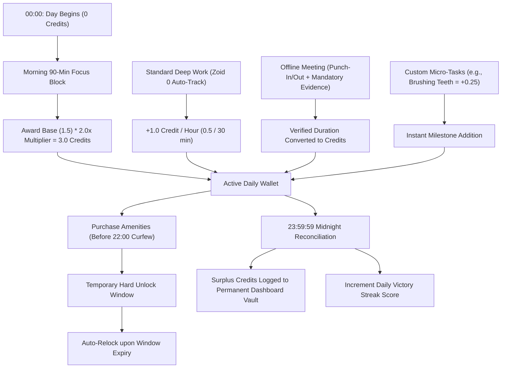
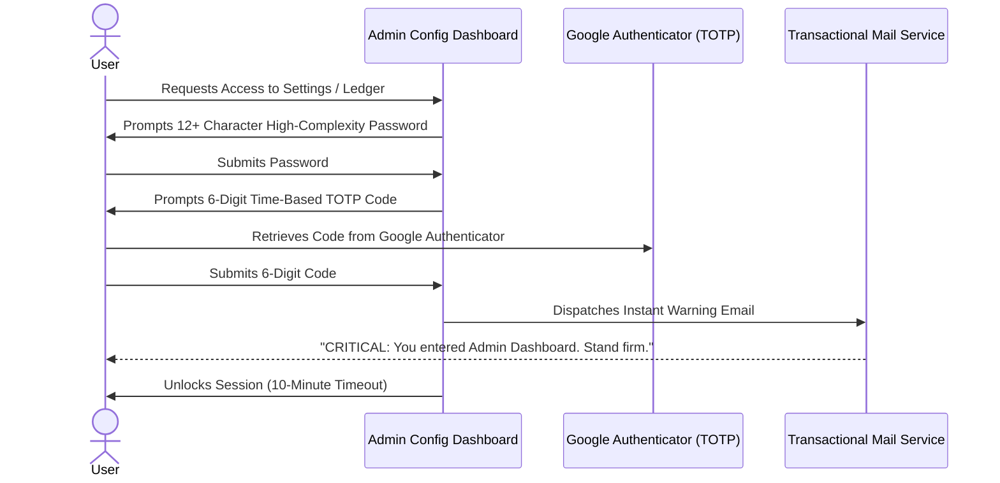

# Product Specification: Zoid Lock In ("The Trading Center")

## 1. System Vision & Behavioral Philosophy

The **Zoid Lock In** application (featuring **The Trading Center**) is an uncompromising, standalone local-first personal economy system engineered to permanently eliminate procrastination, eradicate digital distraction, and enforce daily high-output discipline.

### 1.1. Product Lineage & Scope
- **Independent Standalone Product:** Zoid Lock In is an entirely separate, standalone application with its own dedicated lifecycle and codebase, rather than a feature branch or submodule of Zoid 0.
- **Integrated Zoid 0 Technology:** While architecturally independent, Zoid Lock In directly integrates and builds upon the proven time-tracking engines, duration counters, workspace observation logic, and session timer mechanisms pioneered in Zoid 0. It connects those precise measurement primitives directly to credit minting and hard system lockdowns.

### 1.2. Core Axioms
1. **Zero-Baseline Daily Reset:** Every sunrise begins at **0 credits**. Past victories do not fund today's idleness.
2. **Artificial Scarcity:** Amenities, entertainment, non-essential screen time, food delivery, and basic living comforts must be actively purchased with earned credits.
3. **Hard Digital Enforcement:** Distractions are blocked at the operating system and network level by default. Willpower is replaced by automated system barriers.
4. **Permanent Anti-Cheating Governance:** Accessing configuration or price-tuning controls requires multi-factor authentication and triggers automatic accountability alerts.
5. **Recovery Protection:** Pacing and curfew guardrails prevent late-night binging and maintain circadian health.

---

## 2. The Economic Engine (Earning & Minting)

### 2.1. Standard Earning Model
- **Base Velocity:** 1 hour of verified deep work = **1.0 Credit**.
- **Fractional Milestones:** 30 minutes of continuous focus = **0.5 Credits**.
- **Daily Target Volume:** 6.0 to 10.0 Credits daily to afford full living amenities and recreation.

### 2.2. The 90-Minute Momentum Rule (Cold-Start Breaker)
To resolve the morning cold-start dilemma and create immediate forward momentum:
- **Condition:** Completing the day's first continuous, uninterrupted **90-minute focus block** (1.5 hours of work) completed prior to **12:00 PM Noon** (strictly incentivizing early wake-up). Sessions commencing or finishing after 12:00 PM mint at the standard 1.0x velocity ($1.5\text{ credits}$).
- **Interruption Grace Tolerance:** A 5-minute (300-second) grace window permits brief system sleeps, app restarts, or essential interruptions. Any pause exceeding 5 minutes breaks session continuity and resets the block to minute 0.
- **Reward:** Applies a multiplicative **2.0x multiplier** (double rate) to the session's earnings: 1.5 base credits × 2.0 = **3.0 credits** earned.
- **Work Debt Priority:** If a carried-over deficit debt ($-1.0\text{ credit}$) or emergency debt ($-2.0\text{ credits}$) exists, morning earnings multiply first to $3.0\text{ credits}$, after which the debt is subtracted at the end of the block, releasing the remaining net credits to the wallet.
- **Impact:** Immediately accelerates early-day momentum, securing 3.0 credits which fully satisfies the daily bed amenity or multiple midday rest cycles right from the morning block.

### 2.3. Triple-Gate Offline Meeting Verification (Gemini AI Audit)
For professional commitments occurring off-screen (in-person client meetings, physical strategy sessions, on-site tasks):
1. **Gate 1 (Time Tracking):**
   - User triggers **Punch-In** at the exact start time.
   - User triggers **Punch-Out** immediately upon conclusion.
2. **Gate 2 (Mandatory Verification Bundle):**
   - Three mandatory artifacts must be attached:
     1. **Agenda & Summary Note:** Detailed record of meeting objectives and discussion points.
     2. **Physical / Digital Documentation:** Formal receipt, invoice, payment slip, or calendar invite.
     3. **Contextual Photo:** Physical timestamped photo of the meeting environment or participants.
3. **Gate 3 (Multimodal Gemini AI Audit Engine):**
   - The bundle is dispatched to a multimodal **Gemini API model** (key stored in macOS Keychain) for strict verification.
   - The model inspects the photo and document imagery against the agenda notes and duration for contextual authenticity, visible timestamps, and environmental plausibility.
   - Raw image files are auto-purged after 30 days while cryptographically retaining transaction hashes in SQLite permanently.
   - **Resolution:** Instant approval releases credits into the daily wallet; strict rejection provides constructive denial rationale.
   - **Deep-Reasoning Appeal Escalation:** To eliminate cheating, the user can file an official appeal only after **three consecutive rejections** on the same session. The appeal routes the evidence and user justification through a secondary **Gemini Pro deep-reasoning arbitration pass**. If Gemini Pro affirms, credits are released; if rejected, the session is permanently locked against further claims.

### 2.4. Customizable Micro-Habits & Daily Discipline Tasks
To incentivize essential personal hygiene, wellness, and baseline discipline routines:
- **Concept:** Quick, non-work habits that anchor the day award small fractional credits (e.g., +0.25 credits).
- **Customization Engine:** The user can add, edit, value-scale, and toggle tasks directly via the 2FA Admin Dashboard.
- **Representative Catalog:**
  | Micro-Task | Reward Value | Daily Frequency Limit |
  | :--- | :--- | :--- |
  | **Brushing Teeth / Dental Routine** | +0.25 Credits | Max 2 / Day (Morning & Night) |
  | **Making Bed / Room Reset** | +0.25 Credits | Max 1 / Day |
  | **Daily Hydration Goal (2L Water)** | +0.25 Credits | Max 1 / Day |
  | **Physical Movement / Stretching (15m)** | +0.50 Credits | Max 1 / Day |
- **Anti-Exploitation Safeguards:**
  - Strict daily frequency caps per task prevent credit spamming.
  - Overall micro-habit earnings are capped at a maximum of **1.5 credits total per day**, ensuring that the remaining core credits must be produced through genuine deep work.

### 2.5. Permanent Friday Rest Day Mode
To prevent systemic burnout and support sustainable high performance:
- **Hardcoded Cadence:** Every **Friday** is designated as the official weekly rest day.
- **Permanent System Lock:** Friday Rest Mode is permanently hardcoded into the application core. It **cannot be edited, rescheduled, or toggled off**, even with full 2FA Admin Dashboard privileges.
- **Rest Rules:** Baseline amenities (sleeping in bed, standard food delivery, personal phone time) have **0 credit cost**. Work targets are relaxed/open, and no end-of-day deficit penalties are evaluated.

---

## 3. Hard Digital Enforcement Matrix

Distractions are disabled on macOS and paired iOS devices by default.

### 3.1. Desktop Process Lockdown (Privileged Helper Daemon)
- **Target Applications:** Steam, Discord, Battle.net, Epic Games Launcher, Riot Client, and standalone gaming executables.
- **Daemon Architecture:** Registered and managed via modern macOS `SMAppService.daemon(plistName:)` (macOS 13+).
- **Tamper Defense & Aggressive Keep-Alive:** Configured with `KeepAlive: true`. If forcefully killed via Activity Monitor or Terminal, `launchd` respawns it within 500ms. If an ungraceful crash is detected, it automatically defaults to an immediate fail-closed state, engaging socket-level content filtering and terminating unauthorized target processes until the core state verifies.

### 3.2. Web Domain & Network Lockdown (Network Extension)
- **Target Domains:** `youtube.com`, `reddit.com`, `facebook.com`, `instagram.com`, `x.com` (Twitter), `tiktok.com`, `twitch.tv`, `netflix.com`.
- **Food Delivery Portals:** `talabat.com`, `ubereats.com`, `elmenus.com`, and related online food ordering websites.
- **Mechanism:** Implements Apple's **Network Extension Framework (`NEFilterDataProvider`)** to inspect socket flows at the TLS SNI and HTTP Host layer across macOS (Mac Mini) and mobile, neutralizing VPN, CDN, and iCloud Private Relay bypasses. Blocked destinations render a clean Zoid Lock In "Access Locked: Spend Credits to Unlock" gateway.

### 3.3. Cross-Device Closure (Apple Shortcuts & iOS Focus Filter Window)
- **Problem:** Desktop process locks cause subconscious redirection to mobile screens and mobile food ordering apps.
- **Sync Protocol:** Bi-directional encrypted state sync via **iCloud Drive (`state.json`)** backed by a **Cloudflare Worker push webhook relay** for remote reliability off local Wi-Fi.
- **Action:**
  - Initiating focus sessions triggers **Work Mode** across macOS and iOS via iCloud sync.
  - Silences all notifications and locks mobile entertainment, social, and food ordering applications (Talabat, Uber Eats, etc.).
  - Purchasing passes (e.g., Food Pass or Phone Pass) pushes a state change that triggers an automated **iOS Shortcut Focus Filter Window**, temporarily unblocking apps for the exact purchased duration and automatically re-engaging the shield when the timer expires.

---

## 4. The Marketplace & Amenity Catalog

### 4.1. Calibrated Pricing Schedule

| Tier | Amenity Item | Target Cost | Enforcement Mechanism |
| :--- | :--- | :--- | :--- |
| **Baseline Comfort** | Sleeping in Bed | 3.0 Credits | Self-enforced behavioral contract (Alternative: floor / couch) |
| **Food Delivery** | Ordering Food Delivery (Talabat, Uber Eats) | 2.5 Credits | 30-min window unblocking delivery apps & websites on Mac/Phone |
| **Digital Distraction** | 1 Hour Phone / Social Browsing | 1.5 Credits | Apple Focus Mode temporary release (60 min) |
| **Streaming / Video** | 1 Hour YouTube / Entertainment Video | 1.5 Credits | Network domain unblock window (60 min) |
| **Gaming** | 30 Minutes Gaming Session | 1.5 Credits | macOS process barrier release (30 min) |
| **Social / Outings** | Going Out with Friends / Dinner Outing | 5.0 Credits | Major milestone unlock; requires substantial daily focus |
| **Guilt-Free Rest** | 30-Minute Midday Break | 0.5 Credits | Rest timer without screen distractions |

---

## 5. Curfew, Expiration & The Permanent Vault

### 5.1. 10:00 PM (22:00) Curfew Lockout
- All entertainment, gaming, social media, and food delivery purchases are strictly disabled at **22:00:00**.
- Eliminates late-night credit dumping, binge-gaming, and disordered sleep patterns.

### 5.2. Midnight Expiration & Reconciliation
- At **23:59:59**, the active daily wallet balance is reconciled to **0.0**.
- **The Permanent Surplus Vault:** Surplus unspent credits do not disappear into a void; they are logged into a permanent **"Lifetime Surplus Vault"** displayed on the Zoid Lock In dashboard. This creates long-term pride of discipline and reserves optionality for future long-term expansions.
- **Daily Victory Streak Score:** Finishing the day with the daily target met (all baseline amenities paid and zero deficit) increments the consecutive **Victory Streak**.

### 5.3. End-of-Day Deficit Strikes & Disciplinary Carry-Over
- **Deficit Strike Logging:** If a non-rest day concludes with verified earnings below the 3.0 credit baseline (failing to afford fundamental living comforts), the system logs a permanent **"Deficit Strike"** to the dashboard history.
- **-1.0 Credit Disciplinary Debt (-1 Hour Penalty):** The following morning automatically initializes at **-1.0 Credits** rather than zero.
- **Repayment Constraint:** The user must complete 1 full hour of verified productive work simply to pay off the deficit and return to 0.0 before any new credits can be accumulated for amenities.

---

## 6. High-Friction Anti-Cheating Protocol (Admin Gateway)

To protect the user from impulsive mid-day weakness, adjusting prices, modifying credit balances, or disabling enforcement requires passing a three-tiered security barrier:

1. **Password Barrier:** Minimum 12 characters requiring uppercase, lowercase, numbers, and symbols.
2. **Two-Factor Authentication (2FA):** Standard TOTP algorithm verified via **Google Authenticator**.
3. **Psychological Warning Dispatch:** An automated email is instantly sent to the user's personal inbox:
   > *"CRITICAL SECURITY & INTEGRITY ALERT: You have authenticated into the Zoid 0 Trading Center Admin Settings. Remember why you erected these walls: to conquer procrastination and realize your highest potential. Do not lower prices, grant unearned credits, or negotiate with weakness. Any unearned modification is a defeat."*
4. **48-Hour Cooldown Rate-Limit Lock:**
   - Whenever any configuration edit (amenity price, micro-task reward, blocklist rule) is committed, the dashboard enters a strict **48-Hour Read-Only Lockdown**.
   - No further modifications can be made until the 48-hour cooldown window fully expires, extinguishing impulse concessions and emotional bargaining.
   - **Testing & Staging Override:** During the development and pre-production phase, a dedicated developer override flag bypasses the 48-hour lock to allow rapid testing and iteration. This override is permanently disabled upon production release.

---

## 7. Emergency Safety Valve & Next-Day Debt

### 7.1. Zero-Friction Emergency Override (5-Second Hold)
- For genuine crises (medical urgencies, family emergencies, urgent financial matters), an **Emergency Override** button is always accessible without passwords or 2FA.
- **Physical Interaction:** Requires **pressing and holding the button for 5 continuous seconds**, followed by a confirmation prompt: *"Confirm Emergency Access: This unlocks all distractions for 30 minutes, dispatches an incident audit alert, and levies a mandatory 2-hour focus debt tomorrow."*
- **Execution:** Immediately disables all blocks for exactly **30 minutes**.

### 7.2. Accountability Recoil (The 2-Hour Work Debt)
- Triggering the emergency valve immediately dispatches an incident audit email.
- **Next-Day Work Debt:** The following morning begins with a mandatory **-2.0 Credit Deficit (2-Hour Debt)**.
- The user must complete 2 verified hours of deep work simply to return to 0.0 before any credits can be earned for daytime amenities or evening comforts.

---

## 8. Onboarding: The 3-Day Calibration Phase

To ensure sustainability and prevent psychological rejection of the system:
- **Days 1 to 3 (Audit & Calibration):**
  - All tracking, punch-in timers, and credit ledgers run actively on-screen.
  - Hard blockers operate in **Soft Warning Mode** (displaying warnings and tracking infractions without forcibly killing processes).
  - Validates that daily schedules reliably generate 6–10 hours of verified work.
- **Day 4 Onward (Full Hard Lockdown):**
  - Enforcement daemon engages absolute system-level process killing and domain blacklisting.

---

## 9. System Architecture & Dual Surface UI Matrix

- **Standalone Platform:** Native macOS desktop application (Swift 6, SwiftUI) packaged and versioned independently as **Zoid Lock In**.
- **Dual Surface Form Factor:**
  1. *Persistent Menu Bar Companion (`MenuBarExtra`):* Sits in the macOS menu bar displaying real-time daily credit balance, active session duration, and quick-purchase popover for instant unblocks.
  2. *Command Dashboard Window:* Full-scale standalone application window rendered in the **SUMI-E Ink** visual aesthetic (ink and paper tones, restrained seal-red accents, serif headers) for complete marketplace browsing, offline meeting logging, streak review, and 2FA settings.
- **Integrated Zoid 0 Technology:**
  1. *Screenwatch & Session Tracker:* Adopts Zoid 0's native workspace session tracking and application-level duration measurement primitives to verify deep work without manual timesheets.
  2. *Meeting Infrastructure:* Adopts Zoid 0's meeting verification logic for offline work logging and proof attachment.
- **Dedicated Zoid Lock In Modules:**
  1. `TradingCenterView`: Live wallet balance, active lock statuses, catalog grid, and purchase triggers.
  2. `EnforcementDaemon`: Background observer managing process termination and domain shield enforcement across Mac Mini and phone.
  3. `GeminiAuditService`: Multimodal API client analyzing offline meeting photos, receipts, and agenda notes for automated approval or rejection, managing the 3-rejection appeal threshold.
  4. `OfflineSessionCoordinator`: Punch-in/out timer with evidence file dropzone.
  5. `SecurityGatekeeper`: Password hashing, Google Authenticator TOTP verification, and automated alert email dispatcher.
  6. `CooldownManager`: Enforces the 48-hour configuration rate-limit lockout with development/testing bypass toggles.
  7. `ShortcutBridge`: System-level webhook and Apple Shortcuts sync for cross-device Focus Mode engagement.
