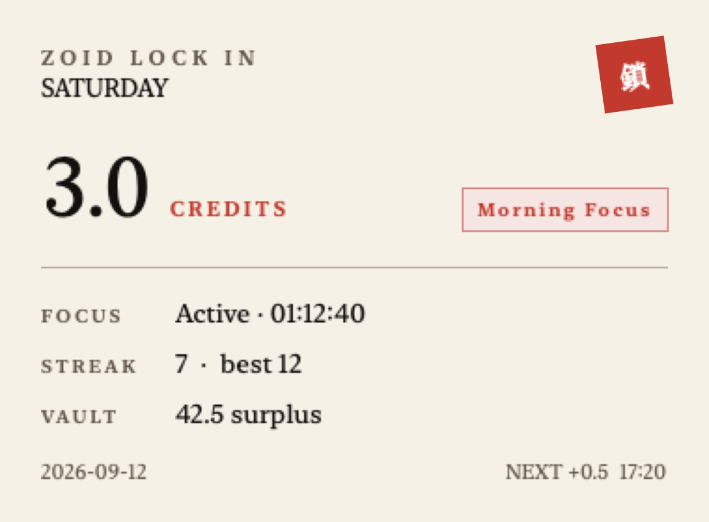
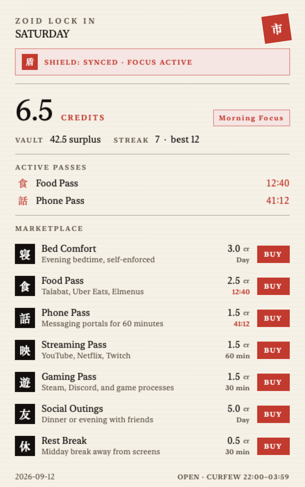

# Zoid Lock In

Earn your distractions. A local-first macOS discipline engine that starts every day at zero credits — deep work unlocks Steam, social, delivery apps, and the rest.

Built for creators and operators who want hard lockdowns on their own Mac, not another soft blocker they can dismiss when willpower dips. Shares the proven local time-tracking DNA from [Zoid 0](https://github.com/Ziad-NasrEldin/Zoid-Zero), as its own standalone product.

<p align="center">
  
</p>

<p align="center">
  
</p>

## What you get

- **Daily credit economy** — mornings start at 0; verified deep work mints credits you spend on entertainment, leisure, and delivery
- **90-minute momentum rule** — finish the first continuous morning focus block and earn a 2× multiplier
- **Hard digital lockdown** — Steam, Discord, YouTube, Reddit, Talabat, Uber Eats, and more blocked by default on Mac (and phone via Shortcuts / Focus)
- **Menu bar + dashboard** — live metrics and quick unblocks in the bar; full Trading Center UI in a SUMI-E Ink aesthetic
- **Anti-cheat admin** — long password, TOTP 2FA, warning email, and a cooldown before config changes stick
- **Curfew & vault** — entertainment purchases cut off at 10 PM; leftover credits roll into a Lifetime Surplus Vault and streak

## Try it

Native Mac app (Swift Package). You need a recent macOS and Xcode / Swift toolchain.

```sh
swift test
swift build
```

Open the built app from `.build/`, grant the permissions it asks for (Focus / Shortcuts on phone if you want the cross-device shield), and start the day at zero.

Full product and architecture notes live in [`PRODUCT.md`](PRODUCT.md), [`PRD.md`](PRD.md), and [`SPEC.md`](SPEC.md).

<p align="center">
  
</p>

---

[MaVoid](https://mavoid.com) · [LinkedIn](https://linkedin.com/in/ziad-ahmed-634202332) · [GitHub](https://github.com/Ziad-NasrEldin)
