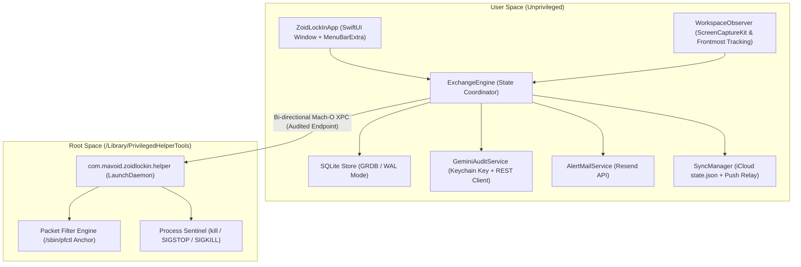
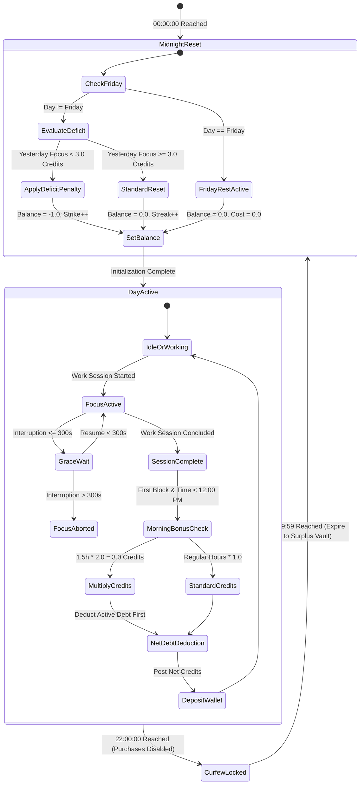

# Technical Specification: Zoid Lock In

## 1. System Topology & Process Architecture

Zoid Lock In is architected as a native macOS local-first application built in Swift 6. It separates untrusted user interface rendering from privileged root-level security enforcement via a dual-process model:



### 1.1. Process Boundaries
1. **`ZoidLockInApp` (User Space):**
   - Renders the native SUMI-E Ink desktop command dashboard and the lightweight `MenuBarExtra` companion.
   - Houses the core business logic (`ExchangeEngine`), event dispatchers, and local SQLite database.
   - Manages network requests to the Gemini API, Resend transactional email API, and iCloud Drive file writes.
2. **`com.mavoid.zoidlockin.helper` (Privileged Daemon):**
   - Installed into `/Library/PrivilegedHelperTools` with a matching plist in `/Library/LaunchDaemons` using `SMJobBless`.
   - Runs with root (`uid 0`) permissions, configured with `KeepAlive: true`.
   - Owns the Packet Filter anchor (`com.mavoid.zoidlockin.pf`) and low-level process termination primitives.
   - Communicates with `ZoidLockInApp` exclusively through a sandboxed Mach-O XPC listener validating process code-signing requirements.

---

## 2. Core Modules & Component Architecture

### 2.1. `ExchangeEngine` (The Primary Testing & Domain Seam)
- **Role:** Pure, deterministic coordinator that consumes timestamped domain events and yields new system states.
- **Responsibilities:**
  - Maintains in-memory wallet balances, debt tracking, and active temporary amenity passes.
  - Evaluates focus duration milestones (+1.0/hr, +0.5/30min).
  - Evaluates the 90-minute morning momentum multiplier (2.0× yield before 12:00 PM).
  - Enforces the 5-minute (300-second) interruption grace window.
  - Computes debt settlement priorities upon session completion.
  - Reconciles midnight expiration, surplus vault accruals, and streak calculations.
  - Enforces the 22:00 curfew and permanent Friday rest rules.

### 2.2. `WorkspaceObserver` (Time Tracking Engine)
- **Engine Heritage:** Ported directly from Zoid 0's native workspace session tracking.
- **Mechanism:** Listens to `NSWorkspace.didActivateApplicationNotification` and window focus transitions via Apple ScreenCaptureKit and Accessibility APIs.
- **Classification:** Whitelisted productive tools (IDEs, terminals, design software, local documents) feed focus ticks into the `ExchangeEngine`. Non-whitelisted apps or screensaver states trigger an interruption timer.

### 2.3. `GeminiAuditService` (Multimodal AI Auditor)
- **Engine:** REST client targeting Google Generative AI (`gemini-1.5-flash` for initial audits; `gemini-1.5-pro` for formal appeals).
- **Security:** API key retrieved at runtime from macOS Keychain (`kSecClassGenericPassword`, service `com.mavoid.zoidlockin.gemini`).
- **Payload Composition:** Sends base64-encoded receipt image, base64-encoded meeting photo, agenda text, start time, end time, and duration.
- **Verification Rule:** Expects strict structured JSON output defining `decision` (`APPROVED` or `REJECTED`), `confidenceScore` (0.0 to 1.0), and `auditNotes`.
- **Appeal Gate:** Increments local failure count. Only permits secondary arbitration when consecutive failures reach 3.

### 2.4. `SecurityGatekeeper` (2FA & Cooldown Controller)
- **Password Auth:** Verifies against Argon2id salted hash stored securely in Keychain.
- **TOTP Engine:** Implements RFC 6238 time-step token verification against a 160-bit shared secret.
- **Email Dispatch:** Sends immediate psychological warning alerts via Resend API (`api.resend.com/emails`) on successful admin authentication.
- **48-Hour Lockout:** Checks `last_config_mutation_epoch`. Rejects mutation payloads unless `(now - last_config_mutation_epoch) >= 172800` seconds (bypassed in debug builds via compiler directive).

### 2.5. `EnforcementDaemon` & `PacketFilterController`
- **Anchor Name:** `com.mavoid.zoidlockin.pf`.
- **Packet Filter Rules:**
  - Block rules redirect outbound traffic on ports 80/443 for target domain IP ranges to `127.0.0.1:8999` (a local lightweight daemon socket that renders the locked splash screen).
- **Process Sentinel:**
  - Scans system process tables every 1.5 seconds.
  - If a target binary signature (Steam, Discord, Battle.net, Epic Games) is detected without an active authorized pass, dispatches `SIGSTOP` followed by `SIGKILL` to prevent execution.
- **Fail-Closed Guarantee:** If communication with `ZoidLockInApp` is lost for more than 5 seconds, the daemon automatically reapplies full lockdown rules.

### 2.6. `SyncManager` (Cross-Device Mobile Shield)
- **Local Storage:** Writes encrypted JSON (`state.json`) to the ubiquitous iCloud Container folder (`iCloud~com~mavoid~zoidlockin`).
- **Relay Dispatch:** Fires HTTP POST webhook to a Cloudflare Worker that publishes Apple Push Notification service (APNs) silent background payloads to registered iOS devices.
- **iOS Automation:** Personal Automation in iOS Shortcuts receives the payload and toggles the dedicated "Lock In" Focus Filter, restricting mobile applications for the duration of the pass.

---

## 3. Database Schema & Data Models (SQLite / GRDB)

The database is initialized under `~/Library/Application Support/ZoidLockIn/db.sqlite` with WAL mode enabled (`PRAGMA journal_mode = WAL`).

### 3.1. DDL Schema Definition

```sql
-- Core Wallet & Global State (Single-Row Configuration)
CREATE TABLE IF NOT EXISTS system_state (
    id INTEGER PRIMARY KEY CHECK (id = 1),
    wallet_balance REAL NOT NULL DEFAULT 0.0,
    active_debt REAL NOT NULL DEFAULT 0.0,
    lifetime_surplus_vault REAL NOT NULL DEFAULT 0.0,
    victory_streak INTEGER NOT NULL DEFAULT 0,
    deficit_strikes INTEGER NOT NULL DEFAULT 0,
    last_reconciliation_date TEXT NOT NULL,
    last_config_mutation_epoch INTEGER NOT NULL DEFAULT 0,
    created_at TEXT NOT NULL DEFAULT (datetime('now')),
    updated_at TEXT NOT NULL DEFAULT (datetime('now'))
);

-- Append-Only Transaction Ledger
CREATE TABLE IF NOT EXISTS wallet_transactions (
    id TEXT PRIMARY KEY,
    transaction_type TEXT NOT NULL, -- 'EARNED_WORK', 'EARNED_MOMENTUM', 'EARNED_MICRO', 'EARNED_MEETING', 'SPENT_AMENITY', 'DEBT_REPAYMENT', 'EMERGENCY_PENALTY'
    amount REAL NOT NULL,
    balance_after REAL NOT NULL,
    description TEXT NOT NULL,
    reference_id TEXT,
    created_at TEXT NOT NULL DEFAULT (datetime('now'))
);

-- Focus Tracking Sessions
CREATE TABLE IF NOT EXISTS focus_sessions (
    id TEXT PRIMARY KEY,
    start_time TEXT NOT NULL,
    end_time TEXT,
    duration_seconds INTEGER NOT NULL DEFAULT 0,
    is_morning_block INTEGER NOT NULL DEFAULT 0, -- 1 if completed before 12:00 PM
    multiplier_applied REAL NOT NULL DEFAULT 1.0,
    credits_minted REAL NOT NULL DEFAULT 0.0,
    interruption_seconds INTEGER NOT NULL DEFAULT 0,
    status TEXT NOT NULL -- 'ACTIVE', 'COMPLETED', 'ABORTED'
);

-- Offline Meeting Audits
CREATE TABLE IF NOT EXISTS offline_meetings (
    id TEXT PRIMARY KEY,
    punch_in_time TEXT NOT NULL,
    punch_out_time TEXT NOT NULL,
    duration_seconds INTEGER NOT NULL,
    agenda_notes TEXT NOT NULL,
    receipt_image_sha256 TEXT NOT NULL,
    photo_image_sha256 TEXT NOT NULL,
    receipt_local_path TEXT,
    photo_local_path TEXT,
    artifacts_purge_date TEXT NOT NULL,
    audit_status TEXT NOT NULL, -- 'PENDING', 'APPROVED', 'REJECTED', 'APPEALED', 'APPEAL_APPROVED', 'SEALED_REJECTED'
    denial_count INTEGER NOT NULL DEFAULT 0,
    ai_reasoning TEXT,
    credits_minted REAL NOT NULL DEFAULT 0.0,
    created_at TEXT NOT NULL DEFAULT (datetime('now'))
);

-- Micro-Habit Catalog
CREATE TABLE IF NOT EXISTS micro_habits (
    id TEXT PRIMARY KEY,
    title TEXT NOT NULL,
    reward_credits REAL NOT NULL,
    daily_limit INTEGER NOT NULL DEFAULT 1,
    is_active INTEGER NOT NULL DEFAULT 1,
    created_at TEXT NOT NULL DEFAULT (datetime('now'))
);

-- Micro-Habit Daily Log
CREATE TABLE IF NOT EXISTS micro_habit_logs (
    id TEXT PRIMARY KEY,
    habit_id TEXT NOT NULL REFERENCES micro_habits(id),
    log_date TEXT NOT NULL, -- 'YYYY-MM-DD'
    created_at TEXT NOT NULL DEFAULT (datetime('now'))
);

-- Active Amenity Passes
CREATE TABLE IF NOT EXISTS active_amenity_passes (
    id TEXT PRIMARY KEY,
    amenity_type TEXT NOT NULL, -- 'FOOD_PASS', 'PHONE_PASS', 'STREAMING_PASS', 'GAMING_PASS', 'EMERGENCY_PASS'
    cost_credits REAL NOT NULL,
    unlocked_at TEXT NOT NULL,
    expires_at TEXT NOT NULL,
    status TEXT NOT NULL -- 'ACTIVE', 'EXPIRED', 'REVOKED'
);

-- Admin Security Audit Log
CREATE TABLE IF NOT EXISTS admin_audit_events (
    id TEXT PRIMARY KEY,
    event_type TEXT NOT NULL, -- 'ADMIN_LOGIN', 'CONFIG_MUTATION', 'EMERGENCY_OVERRIDE', 'PURGE_EXECUTION'
    metadata_json TEXT NOT NULL,
    email_dispatched INTEGER NOT NULL DEFAULT 0,
    created_at TEXT NOT NULL DEFAULT (datetime('now'))
);

-- Indexes for Sub-Millisecond Queries
CREATE INDEX IF NOT EXISTS idx_transactions_created ON wallet_transactions(created_at);
CREATE INDEX IF NOT EXISTS idx_focus_sessions_status ON focus_sessions(status);
CREATE INDEX IF NOT EXISTS idx_meetings_status ON offline_meetings(audit_status);
CREATE INDEX IF NOT EXISTS idx_habit_logs_date ON micro_habit_logs(log_date);
CREATE INDEX IF NOT EXISTS idx_passes_status ON active_amenity_passes(status);
```

---

## 4. State Machine Invariants & Execution Transitions

### 4.1. The Daily Wallet State Machine



### 4.2. Invariant Rules
1. **Wallet Debt Invariant:** Spendable credits cannot be negative. If `active_debt > 0.0`, all incoming minted credits are automatically consumed to reduce `active_debt` to 0.0 before `wallet_balance` can increment.
2. **Curfew Invariant:** No record with `amenity_type IN ('FOOD_PASS', 'GAMING_PASS', 'STREAMING_PASS', 'PHONE_PASS')` can be inserted between `22:00:00` and `04:00:00` local time.
3. **Emergency Recoil Invariant:** Triggering an `EMERGENCY_PASS` sets `active_debt = active_debt + 2.0` scheduled for immediate application during the next `MidnightReset`.
4. **48-Hour Cooldown Invariant:** Any write to `micro_habits` or pricing tables checks `last_config_mutation_epoch + 172800 <= current_epoch`. If false, transaction rolls back immediately.

---

## 5. Security & IPC Specifications

### 5.1. XPC Protocol Interface
The communication interface between `ZoidLockInApp` and the privileged helper daemon:

- **Protocol Name:** `ZoidLockInEnforcementProtocol`
- **Methods:**
  - `applyPolicy(domains: [String], processSignatures: [String], withReply: (Bool) -> Void)`
  - `openTemporaryPass(target: String, durationSeconds: Int, withReply: (Bool) -> Void)`
  - `revokePass(target: String, withReply: (Bool) -> Void)`
  - `queryEnforcementStatus(withReply: (EnforcementState) -> Void)`
  - `engageEmergencySafetyValve(withReply: (Bool) -> Void)`

### 5.2. Packet Filter Anchor Configuration
The daemon generates and loads the anchor rule into `/etc/pf.anchors/com.mavoid.zoidlockin`:

- **Rule Syntax Pattern:**
  - `anchor "com.mavoid.zoidlockin/*"`
  - `table <blocked_domains> persist { ... IP blocks ... }`
  - `rdr pass on lo0 proto tcp from any to <blocked_domains> port {80, 443} -> 127.0.0.1 port 8999`
  - `block return out quick on en0 proto tcp to <blocked_domains>`

---

## 6. Verification Gates & Implementation Roadmap

| Phase | Milestone | Deliverable | Verification Gate |
| :--- | :--- | :--- | :--- |
| **Phase 1** | Core Economic Seam | `ExchangeEngine` + SQLite Store | 100% test pass on wallet reset, 2.0x morning multiplier, 5m grace, debts, curfew, Friday mode |
| **Phase 2** | Privileged Daemon | Root `LaunchDaemon` + `pfctl` wrapper | Process kill verified on Steam/Discord; domain block verified on YouTube/Talabat |
| **Phase 3** | Dual Surface UI | Menu Bar Extra + SUMI-E Ink Window | Menu bar ticker displays live balance; window renders catalog, ledger, and timers |
| **Phase 4** | Multimodal AI Audit | Gemini Client + Appeal Arbitration | Mock offline photo/receipt passes audit; 3-failure trigger unlocks Gemini Pro appeal |
| **Phase 5** | Governance & Sync | 2FA + Resend Mail + iCloud Relay | TOTP verified; alert email received; iOS Shortcut Focus Filter toggled on pass purchase |
| **Phase 6** | Hardening & Calibration | 3-Day Soft Mode -> Hard Lock | Zero crash on daemon restarts; 500ms keep-alive fail-closed behavior verified |
