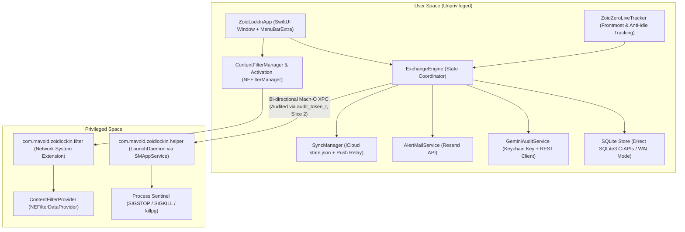
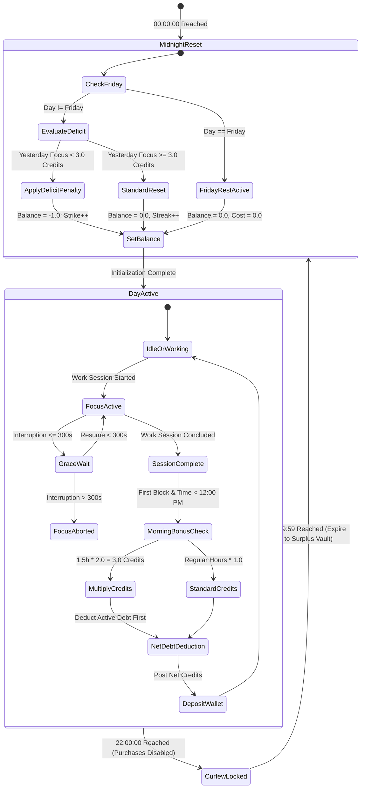

# Technical Specification: Zoid Lock In

## 1. System Topology & Process Architecture

Zoid Lock In is architected as a native macOS local-first application built in Swift 6. It separates untrusted user interface rendering from privileged root-level security enforcement via a **three-process** model. A LaunchDaemon cannot host `NEFilterDataProvider`; the content filter is a Network **System Extension**.



### 1.1. Process Boundaries
1. **`ZoidLockInApp` (User Space):**
   - Renders the native SUMI-E Ink desktop command dashboard and the lightweight `MenuBarExtra` companion.
   - Houses the core business logic (`ExchangeEngine`), event dispatchers, and local SQLite database.
   - Manages network requests to the Gemini API, Resend transactional email API, and iCloud Drive file writes.
   - Activates the Network System Extension via `NEFilterManager` (`ContentFilterActivation`).
2. **`com.mavoid.zoidlockin.helper` (Privileged LaunchDaemon):**
   - Registered and managed via modern macOS `SMAppService.daemon(plistName:)` (macOS 13+ standard).
   - Runs with root (`uid 0`) permissions, configured with `KeepAlive: true` and `ThrottleInterval: 1`.
   - Runs the process sentinel (`proc_pidpath` matching + `killpg`). Does **not** host the content filter.
   - Communicates with `ZoidLockInApp` exclusively through a sandboxed Mach-O XPC listener validating client identity using `audit_token_t` and `SecCodeCheckValidity` against a Team-ID-pinned requirement (`anchor apple generic and certificate leaf[subject.OU] = TEAMID and identifier "com.mavoid.zoidlockin"`). `MachServices` advertises `com.mavoid.zoidlockin.enforcement` together with that validation.
3. **`com.mavoid.zoidlockin.filter` (Network System Extension):**
   - Separate bundle from the LaunchDaemon. Principal class: `ContentFilterProvider` (`NEFilterDataProvider`).
   - Inspects outbound **TCP and UDP** socket flows on ports 80, 443, 8080, and 1080.
   - Fail-closes (drops) inspected flows whose hostname is nil, empty, or an IP literal so Chrome/Electron/QUIC cannot bypass by omitting metadata.

---

## 2. Core Modules & Component Architecture

### 2.1. `ExchangeEngine` (The Primary Testing & Domain Seam)
- **Role:** Pure, deterministic coordinator that consumes timestamped domain events and yields new system states.
- **Anti-Time-Travel Architecture:** Does not trust raw mutable local clock time. Combines hardware monotonic timing (`mach_absolute_time()`) for elapsed duration calculations with an authenticated remote NTP baseline check queried upon startup. If local system time skews more than 120 seconds from the NTP anchor, the engine locks credit transactions and logs a Clock Tamper Incident.
- **Responsibilities:**
  - Maintains in-memory wallet balances, debt tracking, and active temporary amenity passes.
  - Evaluates focus duration milestones (+1.0/hr, +0.5/30min).
  - Evaluates the 90-minute morning momentum multiplier (2.0× yield before 12:00 PM).
  - Enforces the 5-minute (300-second) interruption grace window.
  - Computes debt settlement priorities upon session completion.
  - Reconciles midnight expiration, surplus vault accruals, and streak calculations.
  - Enforces the 22:00 curfew and permanent Friday rest rules.

### 2.2. Live Activity Tracking Engine (`ZoidZeroLiveTracker` & `FocusSessionCoordinator`)
- **Engine Heritage:** Ported directly from Zoid 0's native `ApplicationActivityMonitor` and `UserInputIdleDetector` workspace tracking architecture, dropping legacy ScreenCaptureKit window captures in favor of lightweight application notifications and event source sampling.
- **Live Workspace Observation (`ZoidZeroLiveTracker`):** Registers `NSWorkspace.didActivateApplicationNotification` to intercept frontmost app switches and correlates them with system sleep/wake notifications and screen lock/unlock notifications. Matches active applications against a strict whitelist of productive bundle prefixes (e.g., Xcode, Cursor, VS Code, Terminal, Warp, iTerm2, Linear, Notion, Obsidian, GitHub Client, Figma, Slack, Teams).
- **Anti-Idle HID Sampling & Layered State Separation:**
  - **Tracker Sampling Loop (`ZoidZeroLiveTracker`):** Uses a recurring 5-second `DispatchSourceTimer` sampling physical HID idle duration via `CGEventSource.secondsSinceLastEventType(.combinedSessionState, anyInputEventType)` without capturing keystrokes. When physical inactivity reaches or exceeds the 90-second pause threshold, or when switching away to a non-productive application, tracking enters a paused state (`TrackingPauseReason.idle`, `.nonProductiveApp`, `.sleep`, `.locked`).
  - **Economic Engine State Machine (`FocusMinting` / `ExchangeEngine`):** Manages session presence states independently: micro-pauses with idle `<= 30s` remain in active focus; `30s < idle < 300s` enters the 300-second grace window, holding accrued time; idle `>= 300s` abandons and resets the uncompleted block.
  - **Session Coordination (`FocusSessionCoordinator`):** Bridges live tracking state changes with the `ExchangeEngine`. When a productive app becomes active and user presence is verified, it automatically drives `engine.startFocus()`. On state changes and interruptions, it ticks the engine to evaluate grace windows and credit milestones.

### 2.3. `GeminiAuditService` (Multimodal AI Auditor & Sanitizer)
- **Engine:** REST client targeting Google Generative AI (`gemini-2.5-flash` for initial audits; `gemini-2.5-pro` for formal appeals). Authenticate with the `x-goog-api-key` header only — never a `?key=` query parameter.
- **Security:** API key retrieved at runtime from macOS Keychain (`kSecClassGenericPassword`, service `com.mavoid.zoidlockin.gemini`).
- **Prompt Injection Defense:** Strips markdown tags, control characters, and known system-prompt override phrases from user agenda notes prior to injection into the LLM context.
- **EXIF Metadata Gate:** Parses image binary EXIF headers locally before network dispatch. Requires genuine capture timestamps matching the logged meeting interval and verifies Apple camera lens/device signatures.
- **Verification Rule:** Expects strict structured JSON output defining `decision` (`APPROVED` or `REJECTED`), `confidenceScore` (0.0 to 1.0), and `auditNotes`.
- **Appeal Gate:** Increments local failure count. Only permits secondary arbitration when consecutive failures reach 3.

### 2.4. `SecurityGatekeeper` (2FA & Cooldown Controller)
- **Password Auth:** Verifies against a PBKDF2-HMAC-SHA256 salted hash stored securely in Keychain (`pbkdf2-sha256$iterations$saltB64$hashB64`; 100,000 iterations, 16-byte salt, 32-byte derived key).
- **TOTP Engine:** Implements RFC 6238 time-step token verification against a 160-bit shared secret.
- **Email Dispatch:** Sends immediate psychological warning alerts via Resend API (`api.resend.com/emails`) on successful admin authentication.
- **48-Hour Lockout:** Checks `last_config_mutation_epoch`. Rejects mutation payloads unless `(now - last_config_mutation_epoch) >= 172800` seconds (bypassed in debug builds via compiler directive).

### 2.5. `EnforcementDaemon` & `ContentFilterProvider`
- **Network System Extension Provider:** `ContentFilterProvider` (`NEFilterDataProvider`) lives in `com.mavoid.zoidlockin.filter`, not in the LaunchDaemon. The app enables it with `NEFilterManager`; on macOS 15+ it sets `disableEncryptedDNSSettings`.
- **Filtering Mechanism:** Inspects outbound **TCP and UDP** flows on ports 80, 443, 8080, and 1080. UDP/443 (QUIC / HTTP/3) is fail-closed when the hostname is unverified and dropped when the hostname is blacklisted. Hostname matching uses Network Extension metadata plus suffix rules; missing identity on an inspected port is a drop, not an allow.
- **Process Sentinel:**
  - Scans system process tables every 1.5 seconds.
  - Matches `proc_name` and `proc_pidpath` against launchers, helpers (`steamwebhelper`, Discord Canary/PTB), and Wine/GPTK wrappers.
  - If a target is detected without an active authorized pass, dispatches `SIGSTOP` followed by `SIGKILL` to the process and `killpg` to its process group so child game processes die with the launcher.
- **Fail-Closed & Auto-Respawn:** Registered with `KeepAlive: true` and `ThrottleInterval: 1`. If communication with `ZoidLockInApp` is lost for more than 5 seconds (Slice 2 heartbeat), the daemon automatically reapplies full lockdown rules.

### 2.6. Cross-Device Mobile Shield (`EncryptedStateStore` & `PushRelayClient`)
- **Encrypted State Store (`EncryptedStateStore`):** Persists lock and pass states as an AES-GCM encrypted envelope (`EncryptedStateEnvelope` version 1) in `state.json`. Enforces monotonic sequence counter high-water marks and strict time-travel rejection guards.
- **iCloud Drive & Local Fallback:** Resolves the ubiquitous iCloud Container (`iCloud~com~mavoid~zoidlockin`). If iCloud Drive is unavailable, unauthenticated, or running in an offline/test environment, the store automatically falls back to an isolated local application support path (`~/Library/Application Support/ZoidLockIn/mobile-shield/state.json`), ensuring reliable persistence without unhandled exceptions.
- **Push Relay Dispatch (`PushRelayClient` & `MobileShieldCoordinator`):** Dispatches state synchronization events (`engage_lockdown`, `release_lockdown`, `pass_unlocked`) via an authenticated HTTP POST payload (signed with HMAC-SHA256 or Bearer secret) to a Cloudflare Worker push relay. The worker emits silent APNs background notifications (`SilentAPSPayload`, `content-available: 1`) within a bounded replay window.
- **iOS Automation:** Personal Automations in iOS Shortcuts receive the silent push and toggle the paired iOS "Lock In" Focus Filter, shutting down distracting mobile apps in lockstep with macOS enforcement.

---

## 3. Database Schema & Data Models (Direct SQLite3 C-APIs / WAL Mode)

The local persistence engine uses atomic SQLite with WAL mode, triggers, and transactions via direct system `libsqlite3` C-APIs rather than third-party GRDB or ORMs. This ensures zero third-party dependencies and kernel-safe shared headers, guaranteeing that the privileged helper daemon never links or inherits database engine code.

The database is initialized under `~/Library/Application Support/ZoidLockIn/db.sqlite` (managed via `SQLiteEconomicLedger`) with Write-Ahead Logging (`PRAGMA journal_mode = WAL;`), foreign keys enabled (`PRAGMA foreign_keys = ON;`), busy timeout set to 5000ms (`PRAGMA busy_timeout = 5000;`), and normal synchronous writes (`PRAGMA synchronous = NORMAL;`). Append-only integrity on financial tables is strictly enforced via database triggers (`BEFORE UPDATE` and `BEFORE DELETE` raising abort errors).

### 3.1. DDL Schema Definition

```sql
-- Core Wallet & Global State (Single-Row Configuration)
CREATE TABLE IF NOT EXISTS system_state (
    id INTEGER PRIMARY KEY CHECK (id = 1),
    wallet_balance REAL NOT NULL DEFAULT 0.0,
    active_debt REAL NOT NULL DEFAULT 0.0,
    lifetime_surplus_vault REAL NOT NULL DEFAULT 0.0,
    victory_streak INTEGER NOT NULL DEFAULT 0,
    deficit_strikes INTEGER NOT NULL DEFAULT 0,
    last_reconciliation_date TEXT NOT NULL,
    last_config_mutation_epoch INTEGER NOT NULL DEFAULT 0,
    created_at TEXT NOT NULL DEFAULT (datetime('now')),
    updated_at TEXT NOT NULL DEFAULT (datetime('now'))
);

-- Append-Only Transaction Ledger
CREATE TABLE IF NOT EXISTS wallet_transactions (
    id TEXT PRIMARY KEY,
    transaction_type TEXT NOT NULL, -- 'EARNED_WORK', 'EARNED_MOMENTUM', 'EARNED_MICRO', 'EARNED_MEETING', 'SPENT_AMENITY', 'DEBT_REPAYMENT', 'EMERGENCY_PENALTY'
    amount REAL NOT NULL,
    balance_after REAL NOT NULL,
    description TEXT NOT NULL,
    reference_id TEXT,
    created_at TEXT NOT NULL DEFAULT (datetime('now'))
);

-- Focus Tracking Sessions
CREATE TABLE IF NOT EXISTS focus_sessions (
    id TEXT PRIMARY KEY,
    start_time TEXT NOT NULL,
    end_time TEXT,
    duration_seconds INTEGER NOT NULL DEFAULT 0,
    is_morning_block INTEGER NOT NULL DEFAULT 0, -- 1 if completed before 12:00 PM
    multiplier_applied REAL NOT NULL DEFAULT 1.0,
    credits_minted REAL NOT NULL DEFAULT 0.0,
    interruption_seconds INTEGER NOT NULL DEFAULT 0,
    status TEXT NOT NULL -- 'ACTIVE', 'COMPLETED', 'ABORTED'
);

-- Offline Meeting Audits
CREATE TABLE IF NOT EXISTS offline_meetings (
    id TEXT PRIMARY KEY,
    punch_in_time TEXT NOT NULL,
    punch_out_time TEXT NOT NULL,
    duration_seconds INTEGER NOT NULL,
    agenda_notes TEXT NOT NULL,
    receipt_image_sha256 TEXT NOT NULL,
    photo_image_sha256 TEXT NOT NULL,
    receipt_local_path TEXT,
    photo_local_path TEXT,
    artifacts_purge_date TEXT NOT NULL,
    audit_status TEXT NOT NULL, -- 'PENDING', 'APPROVED', 'REJECTED', 'APPEALED', 'APPEAL_APPROVED', 'SEALED_REJECTED'
    denial_count INTEGER NOT NULL DEFAULT 0,
    ai_reasoning TEXT,
    credits_minted REAL NOT NULL DEFAULT 0.0,
    created_at TEXT NOT NULL DEFAULT (datetime('now'))
);

-- Micro-Habit Catalog
CREATE TABLE IF NOT EXISTS micro_habits (
    id TEXT PRIMARY KEY,
    title TEXT NOT NULL,
    reward_credits REAL NOT NULL,
    daily_limit INTEGER NOT NULL DEFAULT 1,
    is_active INTEGER NOT NULL DEFAULT 1,
    created_at TEXT NOT NULL DEFAULT (datetime('now'))
);

-- Micro-Habit Daily Log
CREATE TABLE IF NOT EXISTS micro_habit_logs (
    id TEXT PRIMARY KEY,
    habit_id TEXT NOT NULL REFERENCES micro_habits(id),
    log_date TEXT NOT NULL, -- 'YYYY-MM-DD'
    created_at TEXT NOT NULL DEFAULT (datetime('now'))
);

-- Active Amenity Passes
CREATE TABLE IF NOT EXISTS active_amenity_passes (
    id TEXT PRIMARY KEY,
    amenity_type TEXT NOT NULL, -- 'FOOD_PASS', 'PHONE_PASS', 'STREAMING_PASS', 'GAMING_PASS', 'EMERGENCY_PASS'
    cost_credits REAL NOT NULL,
    unlocked_at TEXT NOT NULL,
    expires_at TEXT NOT NULL,
    status TEXT NOT NULL -- 'ACTIVE', 'EXPIRED', 'REVOKED'
);

-- Admin Security Audit Log
CREATE TABLE IF NOT EXISTS admin_audit_events (
    id TEXT PRIMARY KEY,
    event_type TEXT NOT NULL, -- 'ADMIN_LOGIN', 'CONFIG_MUTATION', 'EMERGENCY_OVERRIDE', 'PURGE_EXECUTION'
    metadata_json TEXT NOT NULL,
    email_dispatched INTEGER NOT NULL DEFAULT 0,
    created_at TEXT NOT NULL DEFAULT (datetime('now'))
);

-- Indexes for Sub-Millisecond Queries
CREATE INDEX IF NOT EXISTS idx_transactions_created ON wallet_transactions(created_at);
CREATE INDEX IF NOT EXISTS idx_focus_sessions_status ON focus_sessions(status);
CREATE INDEX IF NOT EXISTS idx_meetings_status ON offline_meetings(audit_status);
CREATE INDEX IF NOT EXISTS idx_habit_logs_date ON micro_habit_logs(log_date);
CREATE INDEX IF NOT EXISTS idx_passes_status ON active_amenity_passes(status);
```

---

## 4. State Machine Invariants & Execution Transitions

### 4.1. The Daily Wallet State Machine



### 4.2. Invariant Rules
1. **Wallet Debt Invariant:** Spendable credits cannot be negative. If `active_debt > 0.0`, all incoming minted credits are automatically consumed to reduce `active_debt` to 0.0 before `wallet_balance` can increment.
2. **Curfew Invariant:** No record with `amenity_type IN ('FOOD_PASS', 'GAMING_PASS', 'STREAMING_PASS', 'PHONE_PASS')` can be inserted between `22:00:00` and `04:00:00` local time.
3. **Emergency Recoil Invariant:** Triggering an `EMERGENCY_PASS` sets `active_debt = active_debt + 2.0` scheduled for immediate application during the next `MidnightReset`.
4. **48-Hour Cooldown Invariant:** Any write to `micro_habits` or pricing tables checks `last_config_mutation_epoch + 172800 <= current_epoch`. If false, transaction rolls back immediately.

---

## 5. Security & IPC Specifications

### 5.1. XPC Protocol Interface
The communication interface between `ZoidLockInApp` and the privileged helper daemon:

- **Protocol Name:** `ZoidLockInEnforcementProtocol`
- **Methods:**
  - `applyPolicy(domains: [String], processSignatures: [String], withReply: (Bool) -> Void)`
  - `openTemporaryPass(target: String, durationSeconds: Int, withReply: (Bool) -> Void)`
  - `revokePass(target: String, withReply: (Bool) -> Void)`
  - `queryEnforcementStatus(withReply: (EnforcementState) -> Void)`
  - `engageEmergencySafetyValve(withReply: (Bool) -> Void)`

### 5.2. Network Extension Content Filter Configuration & Activation Flow
The **unprivileged app** manages and configures the system content filter via `ContentFilterManager` and `NEFilterManager.shared()`. The provider runs with bundle identifier `com.mavoid.zoidlockin.filter`.

- **Activation UI Flow in Command Dashboard (PRD #21, SPEC §5.2):**
  - **Component:** The Command Dashboard Settings view integrates a dedicated `ContentFilterSettingsCard` observing `ContentFilterManager`.
  - **Reactive State Lifecycle:** Tracks and displays real-time activation states:
    - `DISABLED` (`DISABLED · NOT CONFIGURED`): Extension not installed or preferences disabled. Displays `ACTIVATE CONTENT FILTER` action button.
    - `PENDING APPROVAL` (`PENDING USER APPROVAL IN SYSTEM SETTINGS`): Extension activation request submitted to `OSSystemExtensionManager`. Displays `PROMPT FILTER AUTHORIZATION` button directing the user to approve the extension in macOS System Settings -> Network -> Filters.
    - `ENABLED` (`ENABLED · CONTENT FILTER`): Extension approved and `NEFilterManager` preferences active with socket filtering enabled.
    - `FAILED` (`ACTIVATION FAILED`): Displays localized error text with retry capability.
  - **Configuration Pipeline:** Upon system extension approval (`request(_:didFinishWithResult:)`), `ContentFilterManager` loads preferences via `NEFilterManager.loadFromPreferences`, attaches `ContentFilterActivation.makeProviderConfiguration()` (explicitly configuring socket filtering via `filterSockets = true` and `filterPackets = false` targeted at `filterDataProviderBundleIdentifier = "com.mavoid.zoidlockin.filter"`), sets `localizedDescription = "Zoid Lock In Content Filter"`, applies `disableEncryptedDNSSettings = true` on macOS 15+ to neutralize DNS-over-HTTPS / Private Relay bypasses, and saves preferences with `isEnabled = true`.
- **Filter Provider:** `ContentFilterProvider`, subclass of `NEFilterDataProvider`, packaged as a Network System Extension (`content-filter-provider-systemextension`) with provider bundle identifier `com.mavoid.zoidlockin.filter`. Interception is strictly socket-level (`filterSockets = true`, `filterPackets = false`).
- **Interception Scope:** Outbound TCP **and UDP** flows targeting ports 80, 443, 8080, and 1080. UDP/443 is inspected so HTTP/3 cannot skip the filter.
- **Rule Resolution Logic:**
  - Extracts hostname from `NEFilterSocketFlow.remoteHostname` or `flow.url` (WebKit / Network.framework metadata). Hostnames are normalized (case-insensitive, leading/trailing dots stripped). IP literals are unverified.
  - On inspected ports, **nil / empty / unverified hostnames fail closed** (`drop`).
  - Compares verified hostnames against blacklisted suffixes (`youtube.com`, `reddit.com`, `facebook.com`, `instagram.com`, `x.com`, `tiktok.com`, `talabat.com`, `ubereats.com`, `elmenus.com`, …).
  - If match found and no active pass token is verified in the privileged cache, returns `NEFilterNewFlowVerdict.drop()`.
  - If active pass token is valid, returns `NEFilterNewFlowVerdict.allow()`.
- **Verification & Test Coverage:** Verified via `ContentFilterActivationTests` and `ContentFilterManagerTests`, validating mock/live preferences loading, approval state machine transitions, and encrypted DNS defeat.
---

## 6. Verification Gates & Hardened 9-Slice Implementation Roadmap

| Slice | Milestone | Deliverable | Verification Gate |
| :--- | :--- | :--- | :--- |
| **Slice 1** | Network Extension & Enforcer Prototype | `SMAppService` Root Daemon + `NEFilterDataProvider` | Zero economic logic. Process termination verified on test target; domain blocking verified at socket layer against VPN/Private Relay. |
| **Slice 2** | XPC Gatekeeper & Emergency Valve | Secure Mach-O XPC with `audit_token_t` + 2FA Gate | Authenticated pause command reliably unblocks network extension for 30 minutes; incident audit event logged. |
| **Slice 3** | Core Economic Ledger & Menu Bar Ticker | `ExchangeEngine` (NTP clock sync, idle detection, 2.0x morning bonus, 5m grace, debts, curfew, Friday rest) + SQLite + Menu Bar | 100% test pass on deterministic state transitions; live credit counter ticks up in macOS Menu Bar. |
| **Slice 4** | Marketplace & Enforcer Integration | Marketplace Purchase Coordinator | Spending 1.5 credits unblocks the Network Extension for 30 minutes; pass auto-expires and re-locks socket traffic. |
| **Slice 5** | Cross-Device Mobile Shield | iCloud Drive `state.json` + Cloudflare Push Relay | Last-Write-Wins conflict resolution; iOS Focus Filter toggled on iPhone when pass purchased on Mac. |
| **Slice 6** | Offline Meeting Core (Local) | Local Meeting Dropzone & SQLite Store | File storage, SHA-256 digests, and local EXIF camera/timestamp validation verified before network dispatch. |
| **Slice 7** | Multimodal AI Audit Integration | Gemini Flash Client + Sanitizer + Gemini Pro Arbitration | Prompt injection stripped; mock photo/receipt verified; 3-rejection threshold escalates to Gemini Pro arbitration. |
| **Slice 8** | Customizable Micro-Habits & Governance | Micro-Habit CRUD + 48-Hour Cooldown | Frequency limits enforced; 1.5 credit/day cap verified; 48-hour edit lockout active with debug override. |
| **Slice 9** | SUMI-E Ink Desktop Dashboard & Calibration | Standalone Command Dashboard | Full SUMI-E Ink interface; 3-day soft calibration warning banner active; full hard lockdown engaged on Day 4. |
| **All Slices** | Complete Unit Test & Security Suite | 33 Test Suites / 271 Tests | 100% passing (271 tests in 33 suites, 0 failures) validating state machine transitions, SQLite append-only triggers, XPC security, Content Filter, and anti-tamper guards. |
